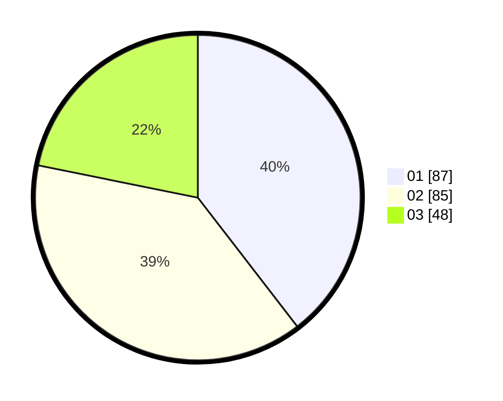

# Hasil

Hasil perolehan suara paslon dapat dilihat pada file paslon-01.txt, paslon-02.txt, dan paslon-03.txt.

Jika tidak ada, artinya data tersebut belum ada pada SIREKAP.

## Perolehan Suara

 * Paslon 01: **87**.
 * Paslon 02: **85**.
 * Paslon 03: **48**.

## Foto C Plano

https://sirekap-obj-formc.kpu.go.id/b6ea/pemilu/ppwp/31/74/06/10/01/3174061001005-20240214-205804--72ca50be-0398-4bd9-bcad-3f5d799d3665.jpg

https://sirekap-obj-formc.kpu.go.id/b6ea/pemilu/ppwp/31/74/06/10/01/3174061001005-20240214-205809--0aac750c-e199-4050-9db8-a6defcc36577.jpg

https://sirekap-obj-formc.kpu.go.id/b6ea/pemilu/ppwp/31/74/06/10/01/3174061001005-20240214-205813--dc21d569-ae79-4e46-8511-ec7d1c54f80b.jpg

## DATA PEMILIH TETAP

Jumlah pemilih dalam DPT: **263**.
 * L: **127**.
 * P: **136**.

## DATA PENGGUNA HAK PILIH

Jumlah pengguna hak pilih dalam DPT: **210**.
 * L: **96**.
 * P: **114**.

Jumlah pengguna hak pilih dalam DPTb: **9**.
 * L: **4**.
 * P: **5**.

Jumlah pengguna hak pilih dalam DPK: **3**.
 * L: **1**.
 * P: **2**.

Jumlah pengguna hak pilih: **222**.
 * L: **101**.
 * P: **121**.

## JUMLAH SUARA SAH DAN TIDAK SAH

JUMLAH SELURUH SUARA SAH: **219**.

JUMLAH SUARA TIDAK SAH: **3**.

JUMLAH SELURUH SUARA SAH DAN SUARA TIDAK SAH: **222**.
