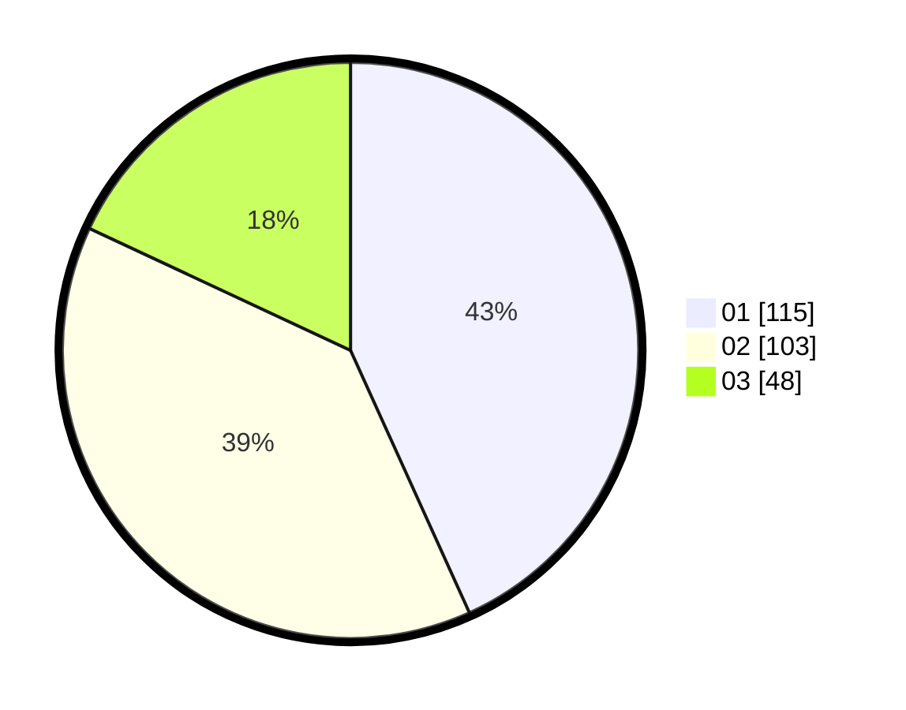

# Hasil

Hasil perolehan suara paslon dapat dilihat pada file paslon-01.txt, paslon-02.txt, dan paslon-03.txt.

Jika tidak ada, artinya data tersebut belum ada pada SIREKAP.

## Perolehan Suara

 * Paslon 01: **115**.
 * Paslon 02: **103**.
 * Paslon 03: **48**.

## Foto C Plano

https://sirekap-obj-formc.kpu.go.id/57da/pemilu/ppwp/31/74/06/10/01/3174061001006-20240214-201741--4f3b28cf-af91-437e-989c-19d50c50f0d8.jpg

https://sirekap-obj-formc.kpu.go.id/57da/pemilu/ppwp/31/74/06/10/01/3174061001006-20240214-201621--da22dafc-6fd6-46b1-87f4-2f299364267a.jpg

https://sirekap-obj-formc.kpu.go.id/57da/pemilu/ppwp/31/74/06/10/01/3174061001006-20240214-201830--baafc8f5-6968-4e4d-94fc-c581c1bf9587.jpg

## DATA PEMILIH TETAP

Jumlah pemilih dalam DPT: **298**.
 * L: **144**.
 * P: **154**.

## DATA PENGGUNA HAK PILIH

Jumlah pengguna hak pilih dalam DPT: **255**.
 * L: **118**.
 * P: **137**.

Jumlah pengguna hak pilih dalam DPTb: **10**.
 * L: **4**.
 * P: **6**.

Jumlah pengguna hak pilih dalam DPK: **3**.
 * L: **1**.
 * P: **2**.

Jumlah pengguna hak pilih: **268**.
 * L: **123**.
 * P: **145**.

## JUMLAH SUARA SAH DAN TIDAK SAH

JUMLAH SELURUH SUARA SAH: **266**.

JUMLAH SUARA TIDAK SAH: **2**.

JUMLAH SELURUH SUARA SAH DAN SUARA TIDAK SAH: **268**.
