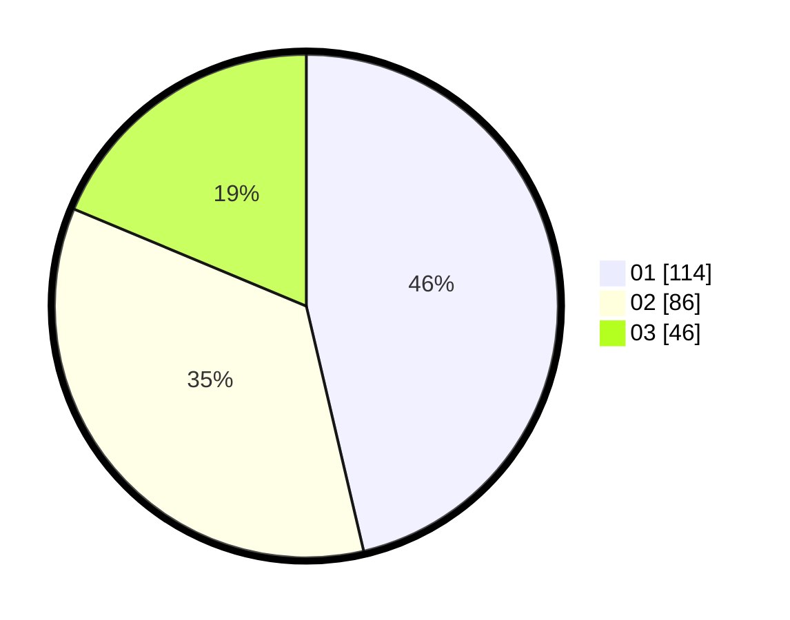

# Hasil

Hasil perolehan suara paslon dapat dilihat pada file paslon-01.txt, paslon-02.txt, dan paslon-03.txt.

Jika tidak ada, artinya data tersebut belum ada pada SIREKAP.

## Perolehan Suara

 * Paslon 01: **114**.
 * Paslon 02: **86**.
 * Paslon 03: **46**.

## Foto C Plano

https://sirekap-obj-formc.kpu.go.id/79a6/pemilu/ppwp/31/74/06/10/01/3174061001007-20240216-160043--8a9683ce-bb78-4cf7-b866-e68689f5afdb.jpg

https://sirekap-obj-formc.kpu.go.id/79a6/pemilu/ppwp/31/74/06/10/01/3174061001007-20240216-160127--ef979558-89af-440a-a063-385666a86d68.jpg

https://sirekap-obj-formc.kpu.go.id/79a6/pemilu/ppwp/31/74/06/10/01/3174061001007-20240216-160209--7c57898a-fd31-4700-944d-269fcb48e7cd.jpg
