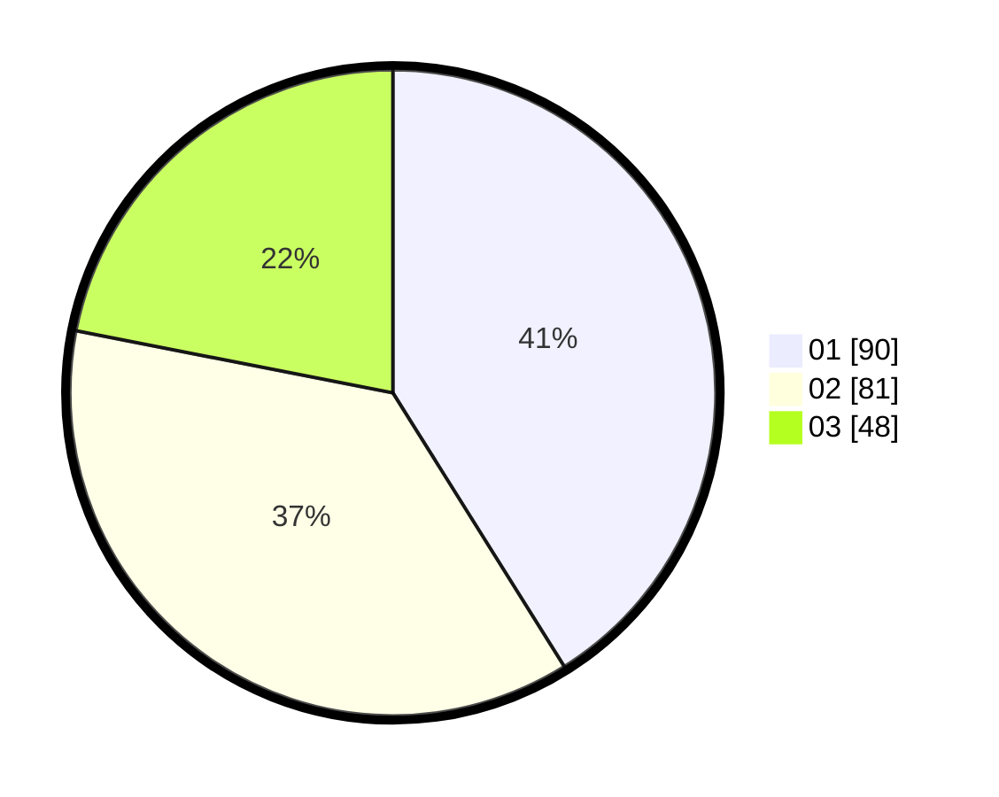

# Hasil

Hasil perolehan suara paslon dapat dilihat pada file paslon-01.txt, paslon-02.txt, dan paslon-03.txt.

Jika tidak ada, artinya data tersebut belum ada pada SIREKAP.

## Perolehan Suara

 * Paslon 01: **90**.
 * Paslon 02: **81**.
 * Paslon 03: **48**.

## Foto C Plano

https://sirekap-obj-formc.kpu.go.id/e0a9/pemilu/ppwp/31/74/06/10/01/3174061001008-20240214-190637--530dbfe1-0857-43ae-a314-1a98a6733059.jpg

https://sirekap-obj-formc.kpu.go.id/e0a9/pemilu/ppwp/31/74/06/10/01/3174061001008-20240214-185755--e4595ad3-4753-46a7-b043-0f263a185df8.jpg

https://sirekap-obj-formc.kpu.go.id/e0a9/pemilu/ppwp/31/74/06/10/01/3174061001008-20240214-190759--7ad22d51-f14f-447d-a73e-1019c25c98d7.jpg

## DATA PEMILIH TETAP

Jumlah pemilih dalam DPT: **268**.
 * L: **136**.
 * P: **132**.

## DATA PENGGUNA HAK PILIH

Jumlah pengguna hak pilih dalam DPT: **210**.
 * L: **109**.
 * P: **101**.

Jumlah pengguna hak pilih dalam DPTb: **9**.
 * L: **3**.
 * P: **6**.

Jumlah pengguna hak pilih dalam DPK: **3**.
 * L: **1**.
 * P: **2**.

Jumlah pengguna hak pilih: **222**.
 * L: **0**.
 * P: **0**.

## JUMLAH SUARA SAH DAN TIDAK SAH

JUMLAH SELURUH SUARA SAH: **219**.

JUMLAH SUARA TIDAK SAH: **3**.

JUMLAH SELURUH SUARA SAH DAN SUARA TIDAK SAH: **222**.
