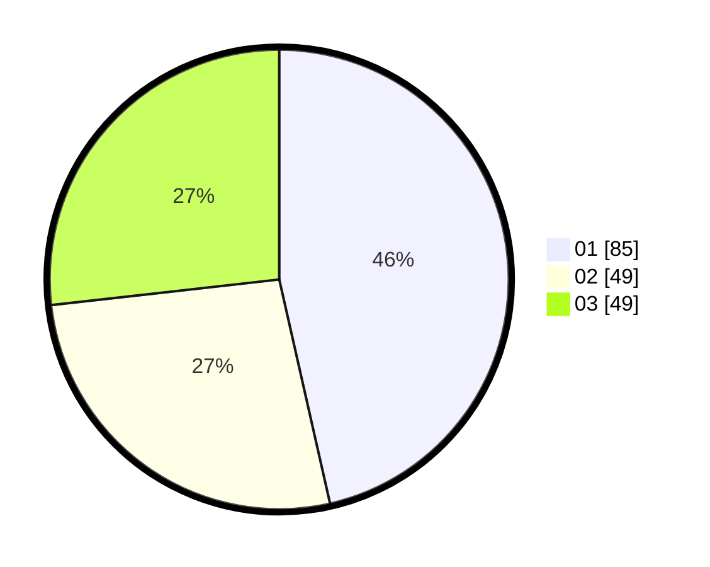

# Hasil

Hasil perolehan suara paslon dapat dilihat pada file paslon-01.txt, paslon-02.txt, dan paslon-03.txt.

Jika tidak ada, artinya data tersebut belum ada pada SIREKAP.

## Perolehan Suara

 * Paslon 01: **85**.
 * Paslon 02: **49**.
 * Paslon 03: **49**.

## Foto C Plano

https://sirekap-obj-formc.kpu.go.id/26f9/pemilu/ppwp/31/74/06/10/01/3174061001010-20240214-203847--c4612e25-85e3-4cac-99c9-58473b897353.jpg

https://sirekap-obj-formc.kpu.go.id/26f9/pemilu/ppwp/31/74/06/10/01/3174061001010-20240214-204026--7a181c83-89dd-44d8-afe3-d1af32c0853e.jpg

https://sirekap-obj-formc.kpu.go.id/26f9/pemilu/ppwp/31/74/06/10/01/3174061001010-20240214-204120--7b10ade0-5714-49a4-85b1-57ad92d0f11d.jpg
