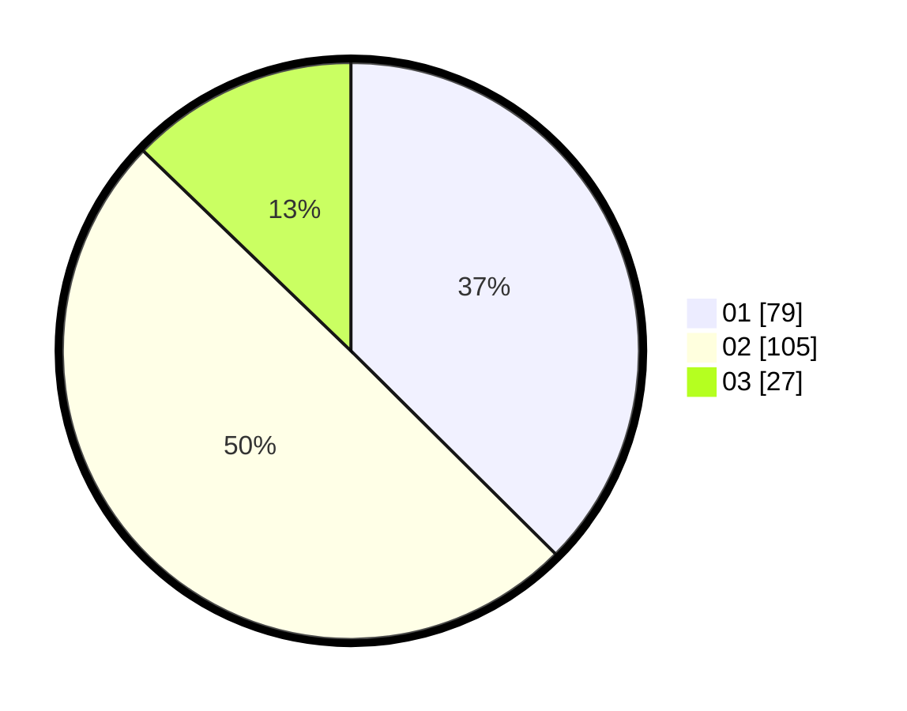

# Hasil

Hasil perolehan suara paslon dapat dilihat pada file paslon-01.txt, paslon-02.txt, dan paslon-03.txt.

Jika tidak ada, artinya data tersebut belum ada pada SIREKAP.

## Perolehan Suara

 * Paslon 01: **79**.
 * Paslon 02: **105**.
 * Paslon 03: **27**.

## Foto C Plano

https://sirekap-obj-formc.kpu.go.id/9f9b/pemilu/ppwp/31/74/06/10/01/3174061001012-20240216-171802--b9fe2c8b-f10b-4c29-97c4-c617e451024b.jpg

https://sirekap-obj-formc.kpu.go.id/9f9b/pemilu/ppwp/31/74/06/10/01/3174061001012-20240216-171647--82602cc6-35c6-43f2-aa3a-4b8aee4ecb1c.jpg

https://sirekap-obj-formc.kpu.go.id/9f9b/pemilu/ppwp/31/74/06/10/01/3174061001012-20240218-175133--81eda1d1-18e4-47e0-869e-6cbab7d8ed55.jpg
