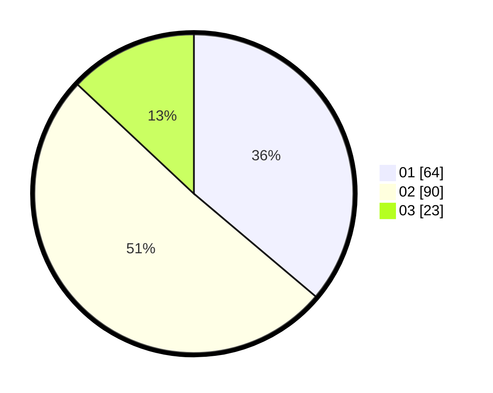

# Hasil

Hasil perolehan suara paslon dapat dilihat pada file paslon-01.txt, paslon-02.txt, dan paslon-03.txt.

Jika tidak ada, artinya data tersebut belum ada pada SIREKAP.

## Perolehan Suara

 * Paslon 01: **64**.
 * Paslon 02: **90**.
 * Paslon 03: **23**.

## Foto C Plano

https://sirekap-obj-formc.kpu.go.id/3649/pemilu/ppwp/31/74/06/10/01/3174061001015-20240214-192830--c9815af9-4bdf-4ca6-b804-0f9def890f72.jpg

https://sirekap-obj-formc.kpu.go.id/3649/pemilu/ppwp/31/74/06/10/01/3174061001015-20240214-190032--4bc2ff19-0001-47a5-9f76-e93c8792a522.jpg

https://sirekap-obj-formc.kpu.go.id/3649/pemilu/ppwp/31/74/06/10/01/3174061001015-20240214-193059--95b00a53-7874-4b63-964f-1ceeb05e6940.jpg

## DATA PEMILIH TETAP

Jumlah pemilih dalam DPT: **222**.
 * L: **107**.
 * P: **115**.

## DATA PENGGUNA HAK PILIH

Jumlah pengguna hak pilih dalam DPT: **170**.
 * L: **78**.
 * P: **92**.

Jumlah pengguna hak pilih dalam DPTb: **7**.
 * L: **1**.
 * P: **6**.

Jumlah pengguna hak pilih dalam DPK: **0**.
 * L: **0**.
 * P: **0**.

Jumlah pengguna hak pilih: **177**.
 * L: **79**.
 * P: **98**.

## JUMLAH SUARA SAH DAN TIDAK SAH

JUMLAH SELURUH SUARA SAH: **177**.

JUMLAH SUARA TIDAK SAH: **0**.

JUMLAH SELURUH SUARA SAH DAN SUARA TIDAK SAH: **177**.
