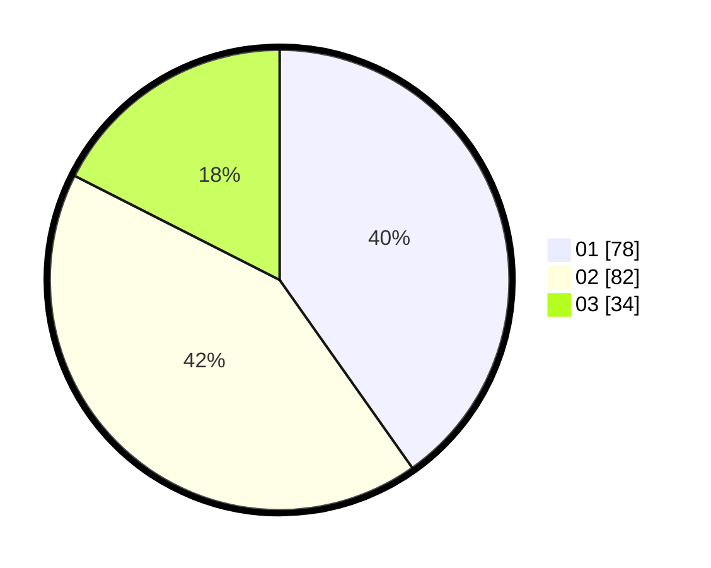

# Hasil

Hasil perolehan suara paslon dapat dilihat pada file paslon-01.txt, paslon-02.txt, dan paslon-03.txt.

Jika tidak ada, artinya data tersebut belum ada pada SIREKAP.

## Perolehan Suara

 * Paslon 01: **78**.
 * Paslon 02: **82**.
 * Paslon 03: **34**.

## Foto C Plano

https://sirekap-obj-formc.kpu.go.id/3bef/pemilu/ppwp/31/74/06/10/01/3174061001017-20240214-192709--10d284ee-bad8-4f06-9dfc-025a084d5041.jpg

https://sirekap-obj-formc.kpu.go.id/3bef/pemilu/ppwp/31/74/06/10/01/3174061001017-20240214-141725--1e224e96-99fb-42ec-970a-d1c3b9f07af4.jpg

https://sirekap-obj-formc.kpu.go.id/3bef/pemilu/ppwp/31/74/06/10/01/3174061001017-20240214-141757--97cb2e53-f18e-4171-8b60-8fadda6ea0ea.jpg
