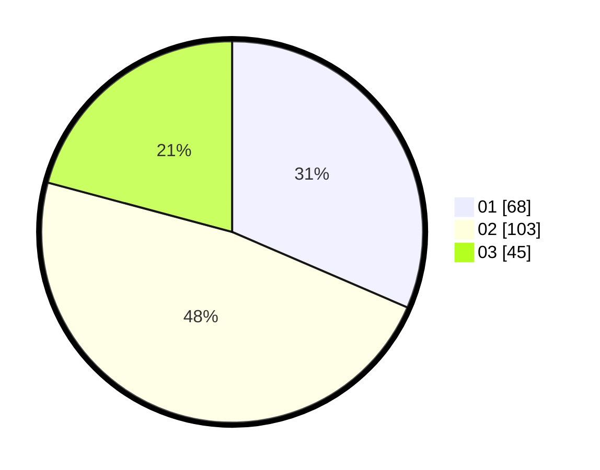

# Hasil

Hasil perolehan suara paslon dapat dilihat pada file paslon-01.txt, paslon-02.txt, dan paslon-03.txt.

Jika tidak ada, artinya data tersebut belum ada pada SIREKAP.

## Perolehan Suara

 * Paslon 01: **68**.
 * Paslon 02: **103**.
 * Paslon 03: **45**.

## Foto C Plano

https://sirekap-obj-formc.kpu.go.id/4821/pemilu/ppwp/31/74/06/10/01/3174061001025-20240215-234827--f5ba0880-b943-44a0-a0da-39093b0562e6.jpg

https://sirekap-obj-formc.kpu.go.id/4821/pemilu/ppwp/31/74/06/10/01/3174061001025-20240215-234830--8672e800-3d84-44fd-9def-c8ad3522e6df.jpg

https://sirekap-obj-formc.kpu.go.id/4821/pemilu/ppwp/31/74/06/10/01/3174061001025-20240215-234830--c70324fe-9360-4b4a-83db-6e7d36f09c81.jpg

## DATA PEMILIH TETAP

Jumlah pemilih dalam DPT: **273**.
 * L: **136**.
 * P: **137**.

## DATA PENGGUNA HAK PILIH

Jumlah pengguna hak pilih dalam DPT: **220**.
 * L: **103**.
 * P: **117**.

Jumlah pengguna hak pilih dalam DPTb: **0**.
 * L: **0**.
 * P: **0**.

Jumlah pengguna hak pilih dalam DPK: **1**.
 * L: **1**.
 * P: **0**.

Jumlah pengguna hak pilih: **221**.
 * L: **220**.
 * P: **1**.

## JUMLAH SUARA SAH DAN TIDAK SAH

JUMLAH SELURUH SUARA SAH: **216**.

JUMLAH SUARA TIDAK SAH: **5**.

JUMLAH SELURUH SUARA SAH DAN SUARA TIDAK SAH: **221**.
