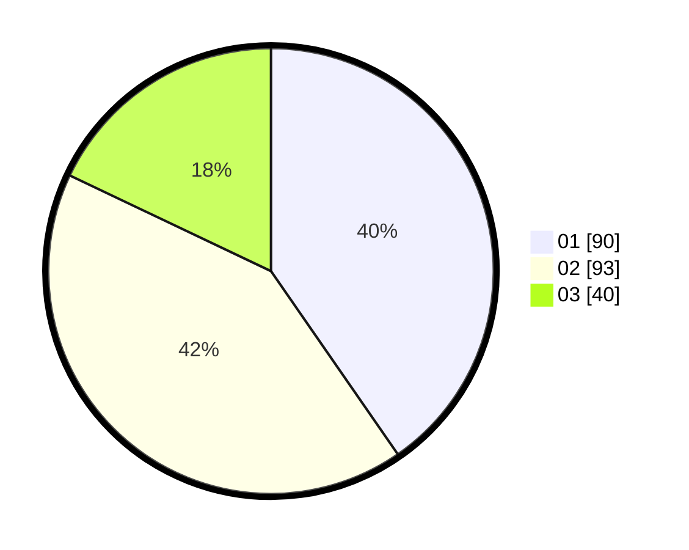

# Hasil

Hasil perolehan suara paslon dapat dilihat pada file paslon-01.txt, paslon-02.txt, dan paslon-03.txt.

Jika tidak ada, artinya data tersebut belum ada pada SIREKAP.

## Perolehan Suara

 * Paslon 01: **90**.
 * Paslon 02: **93**.
 * Paslon 03: **40**.

## Foto C Plano

https://sirekap-obj-formc.kpu.go.id/176a/pemilu/ppwp/31/74/06/10/01/3174061001029-20240216-174925--89feca31-8590-4a63-ab85-8a8a61a48e09.jpg

https://sirekap-obj-formc.kpu.go.id/176a/pemilu/ppwp/31/74/06/10/01/3174061001029-20240216-175013--52a221cd-66d3-48f6-8326-710be403b7f6.jpg

https://sirekap-obj-formc.kpu.go.id/176a/pemilu/ppwp/31/74/06/10/01/3174061001029-20240216-175055--d043b1a5-b8e5-4133-b09c-88e8b4c54c14.jpg
