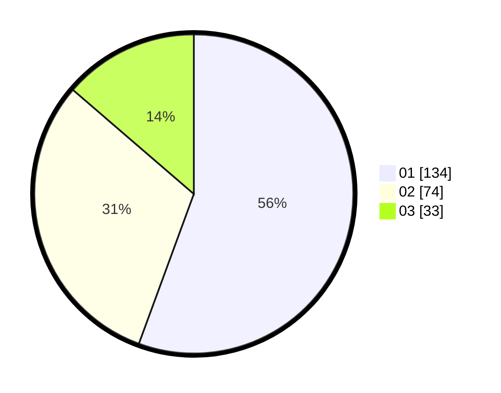

# Hasil

Hasil perolehan suara paslon dapat dilihat pada file paslon-01.txt, paslon-02.txt, dan paslon-03.txt.

Jika tidak ada, artinya data tersebut belum ada pada SIREKAP.

## Perolehan Suara

 * Paslon 01: **134**.
 * Paslon 02: **74**.
 * Paslon 03: **33**.

## Foto C Plano

https://sirekap-obj-formc.kpu.go.id/2b09/pemilu/ppwp/31/74/06/10/01/3174061001031-20240214-213901--2c1a5827-0e4c-4076-986e-0289ce72646a.jpg

https://sirekap-obj-formc.kpu.go.id/2b09/pemilu/ppwp/31/74/06/10/01/3174061001031-20240214-195519--0e31d242-bb56-4f80-8535-b46841a27f76.jpg

https://sirekap-obj-formc.kpu.go.id/2b09/pemilu/ppwp/31/74/06/10/01/3174061001031-20240214-195602--82b22c36-1003-4c41-a6f9-9a789d3e441d.jpg
