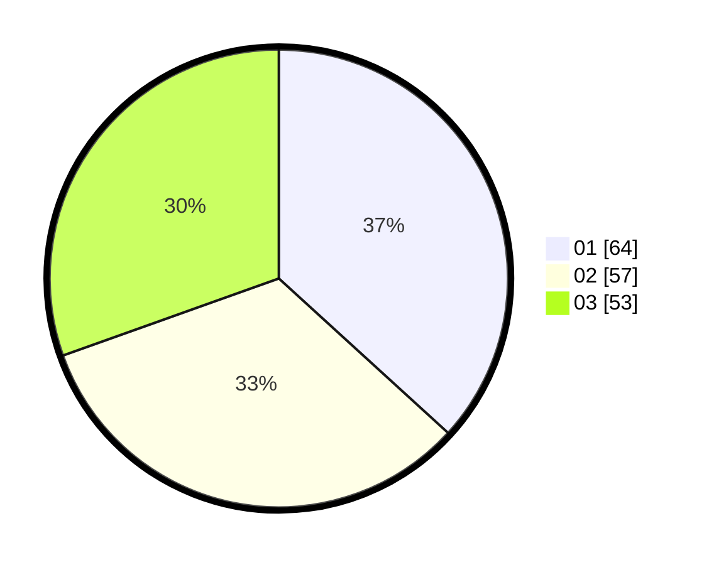

# Hasil

Hasil perolehan suara paslon dapat dilihat pada file paslon-01.txt, paslon-02.txt, dan paslon-03.txt.

Jika tidak ada, artinya data tersebut belum ada pada SIREKAP.

## Perolehan Suara

 * Paslon 01: **64**.
 * Paslon 02: **57**.
 * Paslon 03: **53**.

## Foto C Plano

https://sirekap-obj-formc.kpu.go.id/ebc4/pemilu/ppwp/31/74/06/10/01/3174061001033-20240216-200143--3d692e5c-c3e1-40db-aaed-c3cc74fea035.jpg

https://sirekap-obj-formc.kpu.go.id/ebc4/pemilu/ppwp/31/74/06/10/01/3174061001033-20240214-210458--3e537245-8811-4087-a115-54b316646663.jpg

https://sirekap-obj-formc.kpu.go.id/ebc4/pemilu/ppwp/31/74/06/10/01/3174061001033-20240214-225836--81c4bc3c-3d3e-41ac-9374-05ce04d88152.jpg
