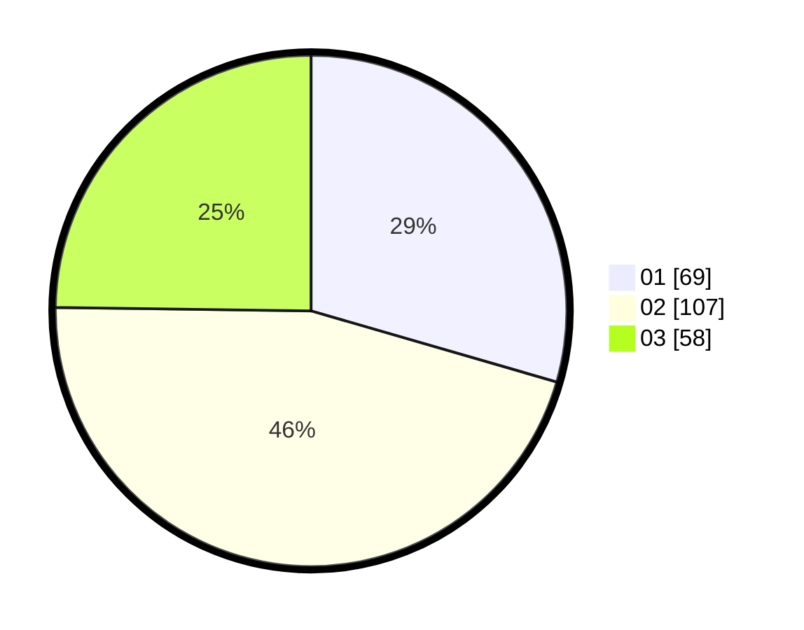

# Hasil

Hasil perolehan suara paslon dapat dilihat pada file paslon-01.txt, paslon-02.txt, dan paslon-03.txt.

Jika tidak ada, artinya data tersebut belum ada pada SIREKAP.

## Perolehan Suara

 * Paslon 01: **69**.
 * Paslon 02: **107**.
 * Paslon 03: **58**.

## Foto C Plano

https://sirekap-obj-formc.kpu.go.id/2008/pemilu/ppwp/31/74/06/10/01/3174061001035-20240216-135620--7d523bce-d9a6-46f6-be89-816aff2b4ac9.jpg

https://sirekap-obj-formc.kpu.go.id/2008/pemilu/ppwp/31/74/06/10/01/3174061001035-20240216-135621--4fad7143-051d-459f-83ab-5e044bd42f57.jpg

https://sirekap-obj-formc.kpu.go.id/2008/pemilu/ppwp/31/74/06/10/01/3174061001035-20240216-135620--a042314e-d2fd-43d5-a7d4-cfd64d7bbc9d.jpg

## DATA PEMILIH TETAP

Jumlah pemilih dalam DPT: **267**.
 * L: **125**.
 * P: **142**.

## DATA PENGGUNA HAK PILIH

Jumlah pengguna hak pilih dalam DPT: **239**.
 * L: **109**.
 * P: **130**.

Jumlah pengguna hak pilih dalam DPTb: **0**.
 * L: **0**.
 * P: **0**.

Jumlah pengguna hak pilih dalam DPK: **0**.
 * L: **0**.
 * P: **0**.

Jumlah pengguna hak pilih: **239**.
 * L: **109**.
 * P: **130**.

## JUMLAH SUARA SAH DAN TIDAK SAH

JUMLAH SELURUH SUARA SAH: **234**.

JUMLAH SUARA TIDAK SAH: **5**.

JUMLAH SELURUH SUARA SAH DAN SUARA TIDAK SAH: **239**.
