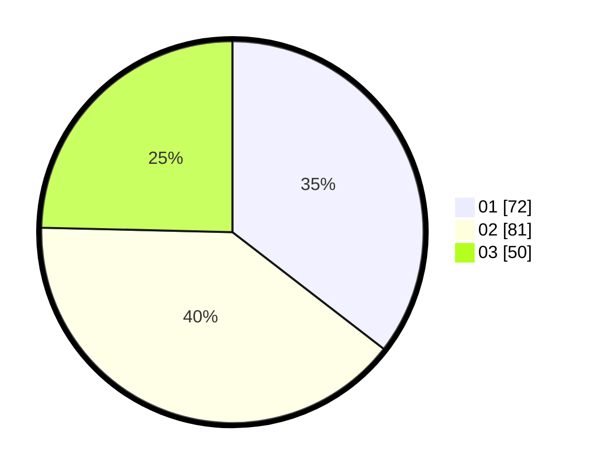

# Hasil

Hasil perolehan suara paslon dapat dilihat pada file paslon-01.txt, paslon-02.txt, dan paslon-03.txt.

Jika tidak ada, artinya data tersebut belum ada pada SIREKAP.

## Perolehan Suara

 * Paslon 01: **72**.
 * Paslon 02: **81**.
 * Paslon 03: **50**.

## Foto C Plano

https://sirekap-obj-formc.kpu.go.id/ab21/pemilu/ppwp/31/74/06/10/01/3174061001038-20240214-222253--4b99c0cf-fcfa-466d-8429-458c53970d37.jpg

https://sirekap-obj-formc.kpu.go.id/ab21/pemilu/ppwp/31/74/06/10/01/3174061001038-20240214-222253--85a01f8d-de36-417a-a25c-acee1b5f33b0.jpg

https://sirekap-obj-formc.kpu.go.id/ab21/pemilu/ppwp/31/74/06/10/01/3174061001038-20240214-222303--c4355873-467c-46ee-81c7-ea1448d3d576.jpg
