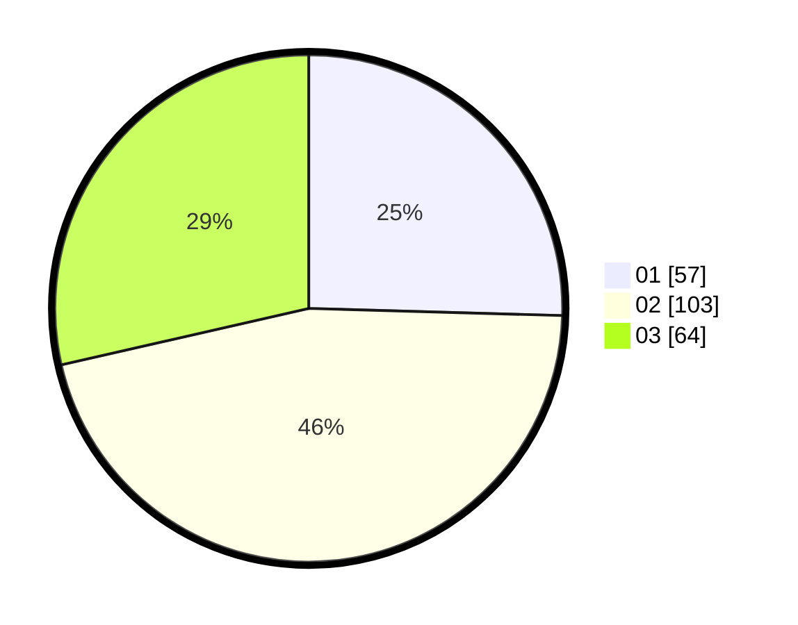

# Hasil

Hasil perolehan suara paslon dapat dilihat pada file paslon-01.txt, paslon-02.txt, dan paslon-03.txt.

Jika tidak ada, artinya data tersebut belum ada pada SIREKAP.

## Perolehan Suara

 * Paslon 01: **57**.
 * Paslon 02: **103**.
 * Paslon 03: **64**.

## Foto C Plano

https://sirekap-obj-formc.kpu.go.id/7f27/pemilu/ppwp/31/74/06/10/01/3174061001046-20240214-213518--8a19bfc3-536d-431f-bec0-3d4697501bd3.jpg

https://sirekap-obj-formc.kpu.go.id/7f27/pemilu/ppwp/31/74/06/10/01/3174061001046-20240214-204214--8f098003-cbfb-407d-81a2-eb6f42b0bace.jpg

https://sirekap-obj-formc.kpu.go.id/7f27/pemilu/ppwp/31/74/06/10/01/3174061001046-20240214-204250--79a67919-18db-4105-8839-12a2a8747aa7.jpg
