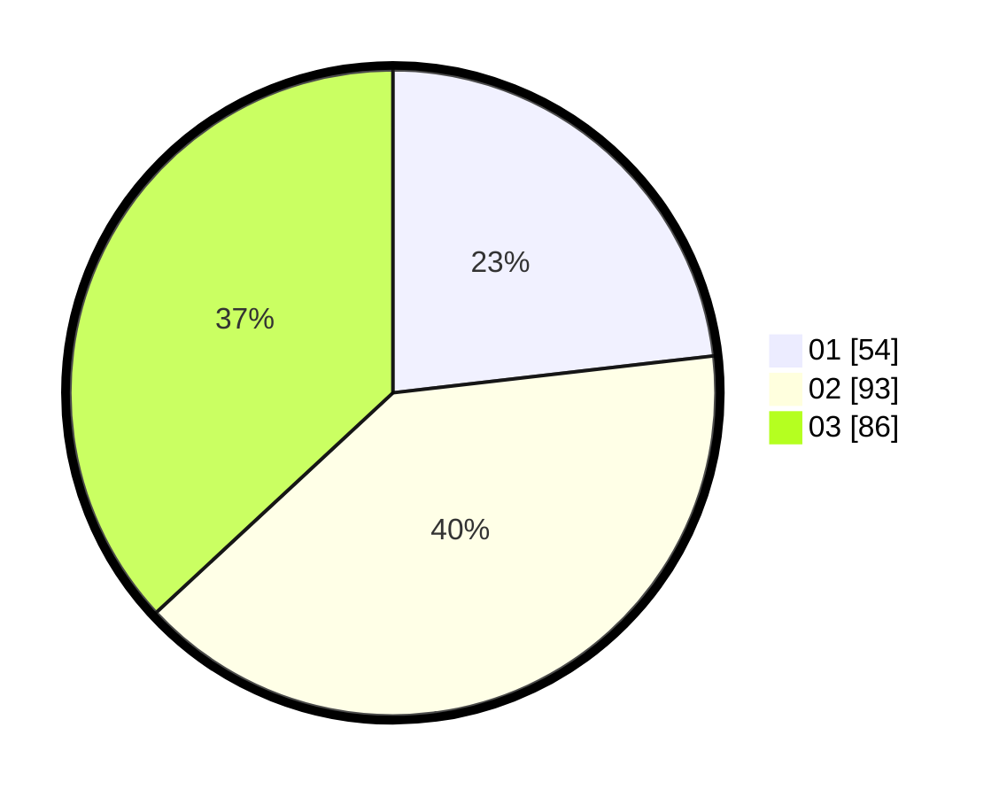

# Hasil

Hasil perolehan suara paslon dapat dilihat pada file paslon-01.txt, paslon-02.txt, dan paslon-03.txt.

Jika tidak ada, artinya data tersebut belum ada pada SIREKAP.

## Perolehan Suara

 * Paslon 01: **54**.
 * Paslon 02: **93**.
 * Paslon 03: **86**.

## Foto C Plano

https://sirekap-obj-formc.kpu.go.id/92b5/pemilu/ppwp/31/74/06/10/01/3174061001047-20240214-155205--e16674eb-6588-40d2-ba2a-369f317d22d2.jpg

https://sirekap-obj-formc.kpu.go.id/92b5/pemilu/ppwp/31/74/06/10/01/3174061001047-20240214-155215--dee82136-80a9-4ba4-b6d5-892539ea3c81.jpg

https://sirekap-obj-formc.kpu.go.id/92b5/pemilu/ppwp/31/74/06/10/01/3174061001047-20240214-155223--633e5e9f-6fed-4a61-aa7c-84504ef9361a.jpg

## DATA PEMILIH TETAP

Jumlah pemilih dalam DPT: **259**.
 * L: **110**.
 * P: **149**.

## DATA PENGGUNA HAK PILIH

Jumlah pengguna hak pilih dalam DPT: **213**.
 * L: **91**.
 * P: **122**.

Jumlah pengguna hak pilih dalam DPTb: **19**.
 * L: **9**.
 * P: **10**.

Jumlah pengguna hak pilih dalam DPK: **2**.
 * L: **1**.
 * P: **1**.

Jumlah pengguna hak pilih: **234**.
 * L: **101**.
 * P: **133**.

## JUMLAH SUARA SAH DAN TIDAK SAH

JUMLAH SELURUH SUARA SAH: **233**.

JUMLAH SUARA TIDAK SAH: **1**.

JUMLAH SELURUH SUARA SAH DAN SUARA TIDAK SAH: **234**.
