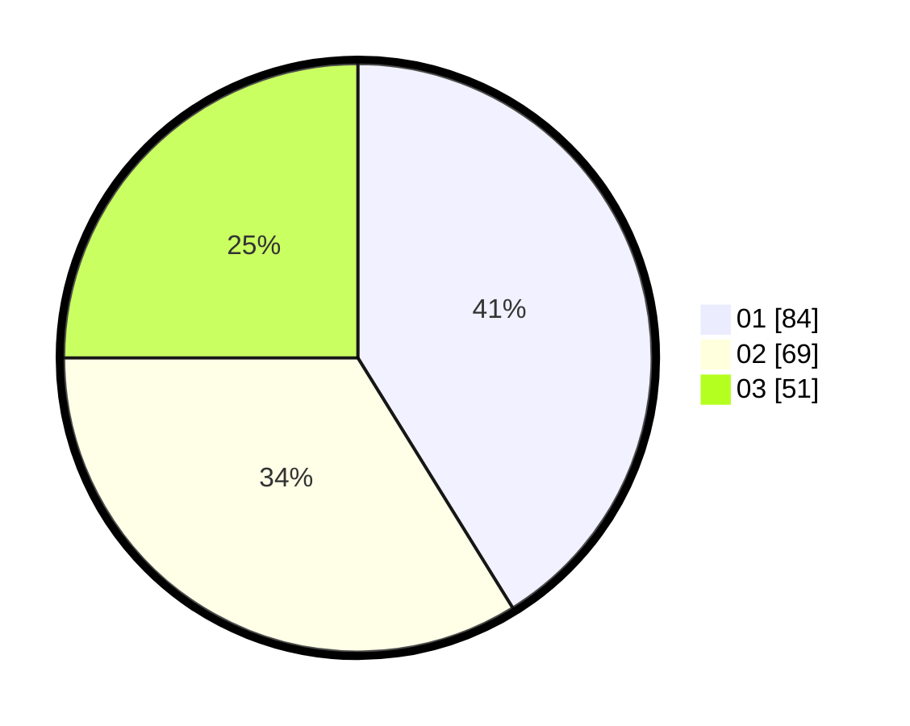

# Hasil

Hasil perolehan suara paslon dapat dilihat pada file paslon-01.txt, paslon-02.txt, dan paslon-03.txt.

Jika tidak ada, artinya data tersebut belum ada pada SIREKAP.

## Perolehan Suara

 * Paslon 01: **84**.
 * Paslon 02: **69**.
 * Paslon 03: **51**.

## Foto C Plano

https://sirekap-obj-formc.kpu.go.id/84a1/pemilu/ppwp/31/74/06/10/01/3174061001078-20240216-041324--c65e410a-3dd1-43fc-9d12-58445bc545cd.jpg

https://sirekap-obj-formc.kpu.go.id/84a1/pemilu/ppwp/31/74/06/10/01/3174061001078-20240214-155011--26715d85-02c3-4f56-abf8-da500368852b.jpg

https://sirekap-obj-formc.kpu.go.id/84a1/pemilu/ppwp/31/74/06/10/01/3174061001078-20240216-041326--251931f5-2ba3-4539-9e8a-e52e1fe320db.jpg

## DATA PEMILIH TETAP

Jumlah pemilih dalam DPT: **244**.
 * L: **120**.
 * P: **124**.

## DATA PENGGUNA HAK PILIH

Jumlah pengguna hak pilih dalam DPT: **192**.
 * L: **96**.
 * P: **96**.

Jumlah pengguna hak pilih dalam DPTb: **12**.
 * L: **2**.
 * P: **10**.

Jumlah pengguna hak pilih dalam DPK: **3**.
 * L: **1**.
 * P: **2**.

Jumlah pengguna hak pilih: **207**.
 * L: **99**.
 * P: **108**.

## JUMLAH SUARA SAH DAN TIDAK SAH

JUMLAH SELURUH SUARA SAH: **204**.

JUMLAH SUARA TIDAK SAH: **3**.

JUMLAH SELURUH SUARA SAH DAN SUARA TIDAK SAH: **207**.
