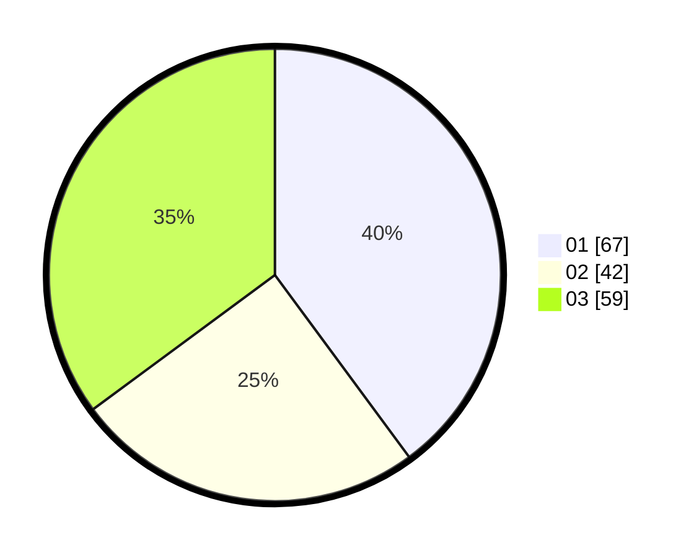

# Hasil

Hasil perolehan suara paslon dapat dilihat pada file paslon-01.txt, paslon-02.txt, dan paslon-03.txt.

Jika tidak ada, artinya data tersebut belum ada pada SIREKAP.

## Perolehan Suara

 * Paslon 01: **67**.
 * Paslon 02: **42**.
 * Paslon 03: **59**.

## Foto C Plano

https://sirekap-obj-formc.kpu.go.id/77ca/pemilu/ppwp/31/74/06/10/01/3174061001081-20240214-155907--70f77110-f130-4e65-b3a0-963b4aceb7dd.jpg

https://sirekap-obj-formc.kpu.go.id/77ca/pemilu/ppwp/31/74/06/10/01/3174061001081-20240214-193807--865c20c1-7668-4a85-ab26-6d78ec4e1e53.jpg

https://sirekap-obj-formc.kpu.go.id/77ca/pemilu/ppwp/31/74/06/10/01/3174061001081-20240214-195615--918dc23e-0b58-457a-be8b-c7bda2b665da.jpg

## DATA PEMILIH TETAP

Jumlah pemilih dalam DPT: **208**.
 * L: **96**.
 * P: **112**.

## DATA PENGGUNA HAK PILIH

Jumlah pengguna hak pilih dalam DPT: **161**.
 * L: **72**.
 * P: **89**.

Jumlah pengguna hak pilih dalam DPTb: **7**.
 * L: **2**.
 * P: **5**.

Jumlah pengguna hak pilih dalam DPK: **2**.
 * L: **0**.
 * P: **2**.

Jumlah pengguna hak pilih: **170**.
 * L: **74**.
 * P: **96**.

## JUMLAH SUARA SAH DAN TIDAK SAH

JUMLAH SELURUH SUARA SAH: **168**.

JUMLAH SUARA TIDAK SAH: **2**.

JUMLAH SELURUH SUARA SAH DAN SUARA TIDAK SAH: **170**.
