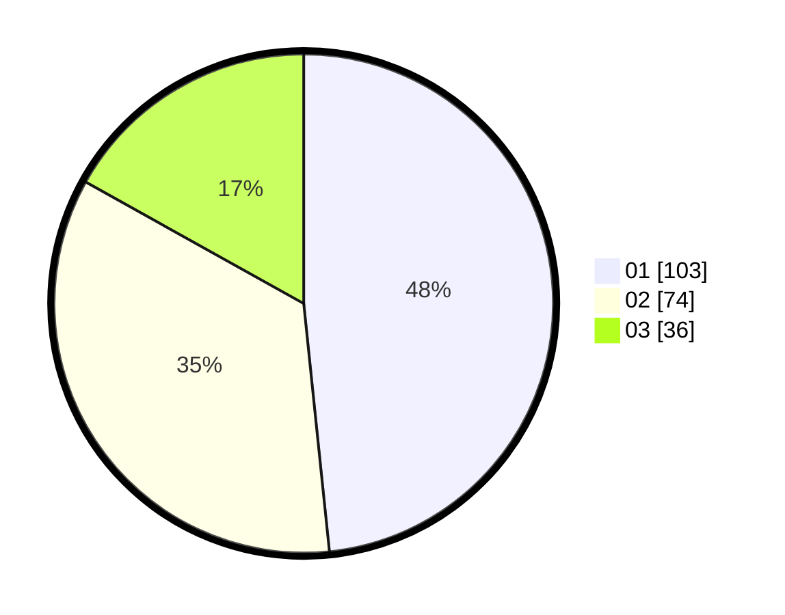

# Hasil

Hasil perolehan suara paslon dapat dilihat pada file paslon-01.txt, paslon-02.txt, dan paslon-03.txt.

Jika tidak ada, artinya data tersebut belum ada pada SIREKAP.

## Perolehan Suara

 * Paslon 01: **103**.
 * Paslon 02: **74**.
 * Paslon 03: **36**.

## Foto C Plano

https://sirekap-obj-formc.kpu.go.id/4057/pemilu/ppwp/31/74/06/10/01/3174061001088-20240214-191220--928aa079-3215-426f-8dde-772bc71f11e9.jpg

https://sirekap-obj-formc.kpu.go.id/4057/pemilu/ppwp/31/74/06/10/01/3174061001088-20240214-191224--14de6e03-8849-4e7b-8849-71f6d3d56b4a.jpg

https://sirekap-obj-formc.kpu.go.id/4057/pemilu/ppwp/31/74/06/10/01/3174061001088-20240214-191228--2d4b9b5e-b85d-46c8-8151-3ff3eadb3d61.jpg

## DATA PEMILIH TETAP

Jumlah pemilih dalam DPT: **264**.
 * L: **129**.
 * P: **135**.

## DATA PENGGUNA HAK PILIH

Jumlah pengguna hak pilih dalam DPT: **207**.
 * L: **97**.
 * P: **110**.

Jumlah pengguna hak pilih dalam DPTb: **7**.
 * L: **2**.
 * P: **5**.

Jumlah pengguna hak pilih dalam DPK: **0**.
 * L: **0**.
 * P: **0**.

Jumlah pengguna hak pilih: **214**.
 * L: **99**.
 * P: **115**.

## JUMLAH SUARA SAH DAN TIDAK SAH

JUMLAH SELURUH SUARA SAH: **213**.

JUMLAH SUARA TIDAK SAH: **1**.

JUMLAH SELURUH SUARA SAH DAN SUARA TIDAK SAH: **214**.
