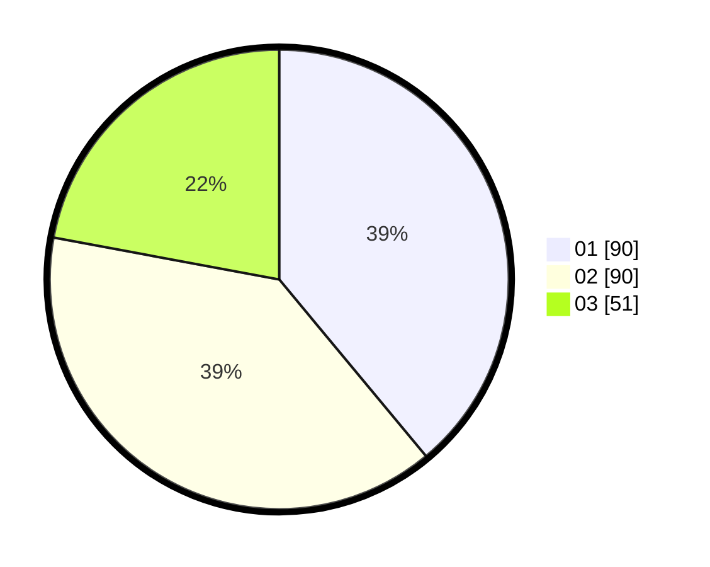

# Hasil

Hasil perolehan suara paslon dapat dilihat pada file paslon-01.txt, paslon-02.txt, dan paslon-03.txt.

Jika tidak ada, artinya data tersebut belum ada pada SIREKAP.

## Perolehan Suara

 * Paslon 01: **90**.
 * Paslon 02: **90**.
 * Paslon 03: **51**.

## Foto C Plano

https://sirekap-obj-formc.kpu.go.id/175e/pemilu/ppwp/31/74/06/10/01/3174061001109-20240214-162219--f8acf96b-22da-48dc-bec2-e02c9c81ddea.jpg

https://sirekap-obj-formc.kpu.go.id/175e/pemilu/ppwp/31/74/06/10/01/3174061001109-20240214-185104--fdbea996-cf81-4f78-9bed-257080aa345d.jpg

https://sirekap-obj-formc.kpu.go.id/175e/pemilu/ppwp/31/74/06/10/01/3174061001109-20240214-184656--cf773148-6c72-4de0-9736-4218be163cce.jpg

## DATA PEMILIH TETAP

Jumlah pemilih dalam DPT: **283**.
 * L: **138**.
 * P: **145**.

## DATA PENGGUNA HAK PILIH

Jumlah pengguna hak pilih dalam DPT: **229**.
 * L: **108**.
 * P: **121**.

Jumlah pengguna hak pilih dalam DPTb: **3**.
 * L: **3**.
 * P: **0**.

Jumlah pengguna hak pilih dalam DPK: **4**.
 * L: **2**.
 * P: **2**.

Jumlah pengguna hak pilih: **236**.
 * L: **113**.
 * P: **123**.

## JUMLAH SUARA SAH DAN TIDAK SAH

JUMLAH SELURUH SUARA SAH: **231**.

JUMLAH SUARA TIDAK SAH: **5**.

JUMLAH SELURUH SUARA SAH DAN SUARA TIDAK SAH: **236**.
