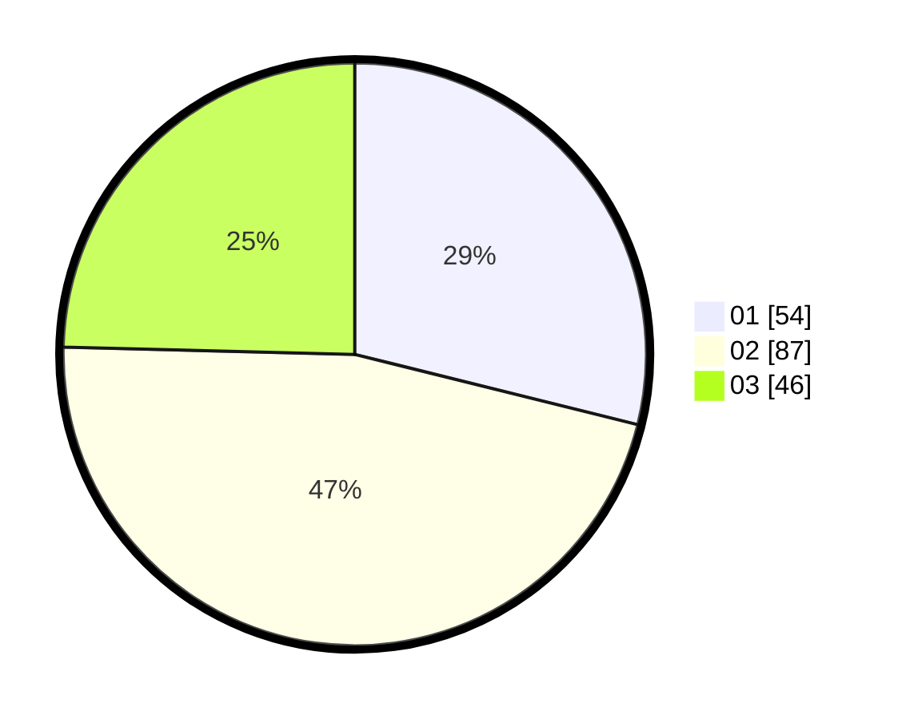

# Hasil

Hasil perolehan suara paslon dapat dilihat pada file paslon-01.txt, paslon-02.txt, dan paslon-03.txt.

Jika tidak ada, artinya data tersebut belum ada pada SIREKAP.

## Perolehan Suara

 * Paslon 01: **54**.
 * Paslon 02: **87**.
 * Paslon 03: **46**.

## Foto C Plano

https://sirekap-obj-formc.kpu.go.id/c804/pemilu/ppwp/31/74/06/10/01/3174061001136-20240214-155505--361340fd-2b34-415c-9a82-738052fadf80.jpg

https://sirekap-obj-formc.kpu.go.id/c804/pemilu/ppwp/31/74/06/10/01/3174061001136-20240214-155824--a337ae13-9da6-462a-931e-18d205acfa12.jpg

https://sirekap-obj-formc.kpu.go.id/c804/pemilu/ppwp/31/74/06/10/01/3174061001136-20240214-184739--5f7c0dad-6970-4cd1-84e9-e2999ee9c4a7.jpg

## DATA PEMILIH TETAP

Jumlah pemilih dalam DPT: **262**.
 * L: **124**.
 * P: **138**.

## DATA PENGGUNA HAK PILIH

Jumlah pengguna hak pilih dalam DPT: **183**.
 * L: **84**.
 * P: **99**.

Jumlah pengguna hak pilih dalam DPTb: **2**.
 * L: **0**.
 * P: **2**.

Jumlah pengguna hak pilih dalam DPK: **3**.
 * L: **1**.
 * P: **2**.

Jumlah pengguna hak pilih: **188**.
 * L: **85**.
 * P: **103**.

## JUMLAH SUARA SAH DAN TIDAK SAH

JUMLAH SELURUH SUARA SAH: **187**.

JUMLAH SUARA TIDAK SAH: **1**.

JUMLAH SELURUH SUARA SAH DAN SUARA TIDAK SAH: **188**.
