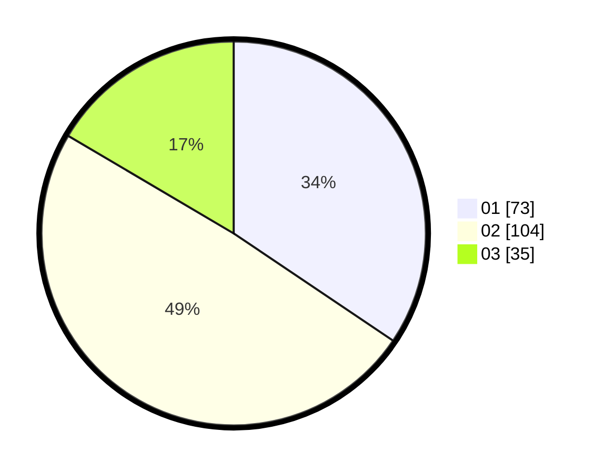

# Hasil

Hasil perolehan suara paslon dapat dilihat pada file paslon-01.txt, paslon-02.txt, dan paslon-03.txt.

Jika tidak ada, artinya data tersebut belum ada pada SIREKAP.

## Perolehan Suara

 * Paslon 01: **73**.
 * Paslon 02: **104**.
 * Paslon 03: **35**.

## Foto C Plano

https://sirekap-obj-formc.kpu.go.id/df35/pemilu/ppwp/31/74/06/10/01/3174061001139-20240214-192843--3cca94a6-0a36-45ce-9507-a4fa2d235081.jpg

https://sirekap-obj-formc.kpu.go.id/df35/pemilu/ppwp/31/74/06/10/01/3174061001139-20240214-192729--51a8df81-c699-4d60-af2b-0deec8a14d31.jpg

https://sirekap-obj-formc.kpu.go.id/df35/pemilu/ppwp/31/74/06/10/01/3174061001139-20240214-192617--472103f2-9583-4bdc-a376-07a6ee96a48e.jpg

## DATA PEMILIH TETAP

Jumlah pemilih dalam DPT: **271**.
 * L: **135**.
 * P: **136**.

## DATA PENGGUNA HAK PILIH

Jumlah pengguna hak pilih dalam DPT: **196**.
 * L: **95**.
 * P: **101**.

Jumlah pengguna hak pilih dalam DPTb: **19**.
 * L: **5**.
 * P: **14**.

Jumlah pengguna hak pilih dalam DPK: **1**.
 * L: **1**.
 * P: **0**.

Jumlah pengguna hak pilih: **216**.
 * L: **101**.
 * P: **115**.

## JUMLAH SUARA SAH DAN TIDAK SAH

JUMLAH SELURUH SUARA SAH: **212**.

JUMLAH SUARA TIDAK SAH: **4**.

JUMLAH SELURUH SUARA SAH DAN SUARA TIDAK SAH: **216**.
