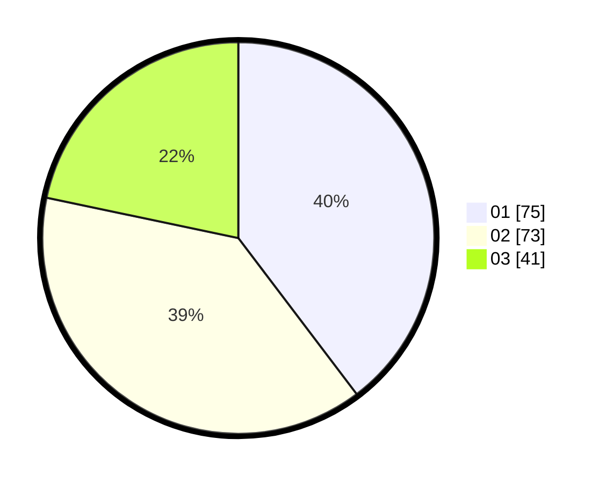

# Hasil

Hasil perolehan suara paslon dapat dilihat pada file paslon-01.txt, paslon-02.txt, dan paslon-03.txt.

Jika tidak ada, artinya data tersebut belum ada pada SIREKAP.

## Perolehan Suara

 * Paslon 01: **75**.
 * Paslon 02: **73**.
 * Paslon 03: **41**.

## Foto C Plano

https://sirekap-obj-formc.kpu.go.id/a52a/pemilu/ppwp/31/74/06/10/01/3174061001143-20240214-213315--be547823-5ff5-48fc-a977-16cda5a46144.jpg

https://sirekap-obj-formc.kpu.go.id/a52a/pemilu/ppwp/31/74/06/10/01/3174061001143-20240214-213325--3772f0bc-53f2-4632-adc0-87ba2bf5240b.jpg

https://sirekap-obj-formc.kpu.go.id/a52a/pemilu/ppwp/31/74/06/10/01/3174061001143-20240214-213332--c9192399-0743-4b20-85fa-205e1a3a6e00.jpg

## DATA PEMILIH TETAP

Jumlah pemilih dalam DPT: **244**.
 * L: **120**.
 * P: **124**.

## DATA PENGGUNA HAK PILIH

Jumlah pengguna hak pilih dalam DPT: **188**.
 * L: **96**.
 * P: **92**.

Jumlah pengguna hak pilih dalam DPTb: **3**.
 * L: **3**.
 * P: **0**.

Jumlah pengguna hak pilih dalam DPK: **3**.
 * L: **1**.
 * P: **2**.

Jumlah pengguna hak pilih: **194**.
 * L: **100**.
 * P: **94**.

## JUMLAH SUARA SAH DAN TIDAK SAH

JUMLAH SELURUH SUARA SAH: **189**.

JUMLAH SUARA TIDAK SAH: **5**.

JUMLAH SELURUH SUARA SAH DAN SUARA TIDAK SAH: **194**.
