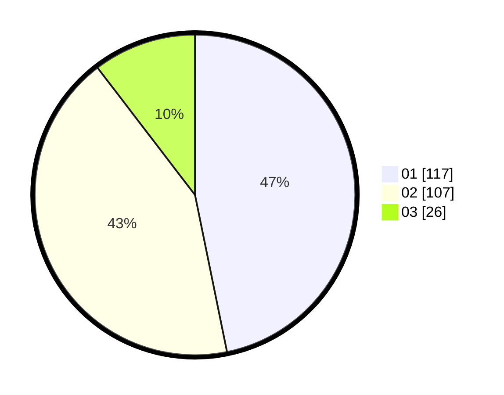

# Hasil

Hasil perolehan suara paslon dapat dilihat pada file paslon-01.txt, paslon-02.txt, dan paslon-03.txt.

Jika tidak ada, artinya data tersebut belum ada pada SIREKAP.

## Perolehan Suara

 * Paslon 01: **117**.
 * Paslon 02: **107**.
 * Paslon 03: **26**.

## Foto C Plano

https://sirekap-obj-formc.kpu.go.id/ab4d/pemilu/ppwp/31/74/06/10/01/3174061001151-20240214-184959--e2f324a3-d075-41a2-a00f-45f3c4f61cf7.jpg

https://sirekap-obj-formc.kpu.go.id/ab4d/pemilu/ppwp/31/74/06/10/01/3174061001151-20240214-185108--622012d0-b979-49ca-b584-7eafd3a6d66f.jpg

https://sirekap-obj-formc.kpu.go.id/ab4d/pemilu/ppwp/31/74/06/10/01/3174061001151-20240214-185342--352d1394-ba5d-4cfa-91a1-858ab307ce2f.jpg

## DATA PEMILIH TETAP

Jumlah pemilih dalam DPT: **293**.
 * L: **145**.
 * P: **148**.

## DATA PENGGUNA HAK PILIH

Jumlah pengguna hak pilih dalam DPT: **241**.
 * L: **116**.
 * P: **125**.

Jumlah pengguna hak pilih dalam DPTb: **9**.
 * L: **3**.
 * P: **6**.

Jumlah pengguna hak pilih dalam DPK: **4**.
 * L: **2**.
 * P: **2**.

Jumlah pengguna hak pilih: **254**.
 * L: **121**.
 * P: **133**.

## JUMLAH SUARA SAH DAN TIDAK SAH

JUMLAH SELURUH SUARA SAH: **250**.

JUMLAH SUARA TIDAK SAH: **4**.

JUMLAH SELURUH SUARA SAH DAN SUARA TIDAK SAH: **254**.
