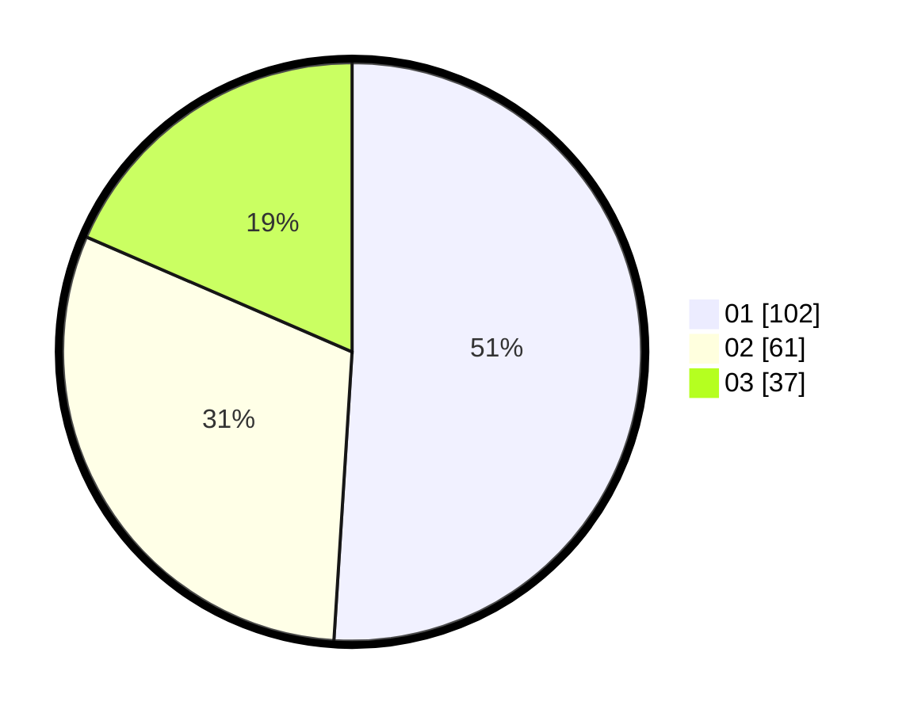

# Hasil

Hasil perolehan suara paslon dapat dilihat pada file paslon-01.txt, paslon-02.txt, dan paslon-03.txt.

Jika tidak ada, artinya data tersebut belum ada pada SIREKAP.

## Perolehan Suara

 * Paslon 01: **102**.
 * Paslon 02: **61**.
 * Paslon 03: **37**.

## Foto C Plano

https://sirekap-obj-formc.kpu.go.id/b3fd/pemilu/ppwp/31/74/06/10/01/3174061001170-20240218-183608--359f42b3-e931-4abb-ac9f-e61c45235be2.jpg

https://sirekap-obj-formc.kpu.go.id/b3fd/pemilu/ppwp/31/74/06/10/01/3174061001170-20240218-184047--fadf0184-86b3-4cea-a6ba-0ee776959db3.jpg

https://sirekap-obj-formc.kpu.go.id/b3fd/pemilu/ppwp/31/74/06/10/01/3174061001170-20240218-183843--3f6245b4-288d-4362-8735-d98d3f5f6b32.jpg

## DATA PEMILIH TETAP

Jumlah pemilih dalam DPT: **203**.
 * L: **99**.
 * P: **104**.

## DATA PENGGUNA HAK PILIH

Jumlah pengguna hak pilih dalam DPT: **201**.
 * L: **98**.
 * P: **103**.

Jumlah pengguna hak pilih dalam DPTb: **1**.
 * L: **0**.
 * P: **1**.

Jumlah pengguna hak pilih dalam DPK: **1**.
 * L: **1**.
 * P: **0**.

Jumlah pengguna hak pilih: **203**.
 * L: **99**.
 * P: **104**.

## JUMLAH SUARA SAH DAN TIDAK SAH

JUMLAH SELURUH SUARA SAH: **200**.

JUMLAH SUARA TIDAK SAH: **3**.

JUMLAH SELURUH SUARA SAH DAN SUARA TIDAK SAH: **203**.
