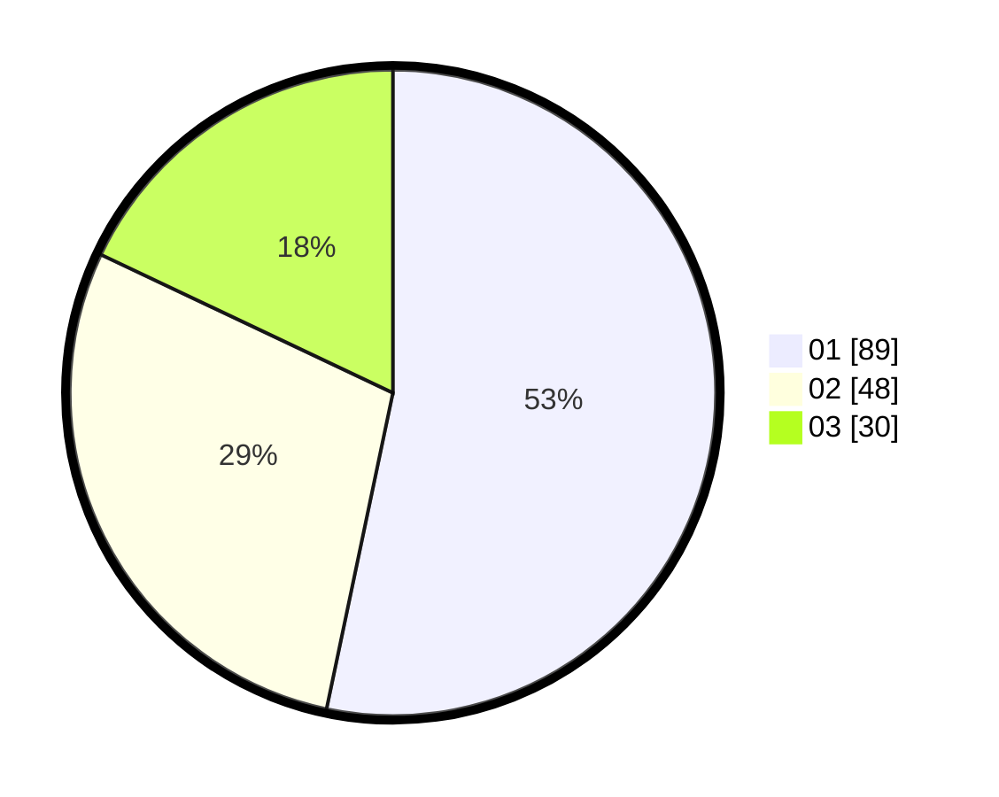

# Hasil

Hasil perolehan suara paslon dapat dilihat pada file paslon-01.txt, paslon-02.txt, dan paslon-03.txt.

Jika tidak ada, artinya data tersebut belum ada pada SIREKAP.

## Perolehan Suara

 * Paslon 01: **89**.
 * Paslon 02: **48**.
 * Paslon 03: **30**.

## Foto C Plano

https://sirekap-obj-formc.kpu.go.id/bf00/pemilu/ppwp/31/74/06/10/01/3174061001171-20240215-154612--5ac13db1-ba2a-468b-bc6a-8ab61d17f87d.jpg

https://sirekap-obj-formc.kpu.go.id/bf00/pemilu/ppwp/31/74/06/10/01/3174061001171-20240216-211401--431bbdf8-58d2-490d-b14b-d2765400b822.jpg

https://sirekap-obj-formc.kpu.go.id/bf00/pemilu/ppwp/31/74/06/10/01/3174061001171-20240215-155209--fbb269e6-62c1-4700-9c10-032a01b3698d.jpg

## DATA PEMILIH TETAP

Jumlah pemilih dalam DPT: **210**.
 * L: **107**.
 * P: **103**.

## DATA PENGGUNA HAK PILIH

Jumlah pengguna hak pilih dalam DPT: **162**.
 * L: **82**.
 * P: **80**.

Jumlah pengguna hak pilih dalam DPTb: **4**.
 * L: **3**.
 * P: **1**.

Jumlah pengguna hak pilih dalam DPK: **1**.
 * L: **0**.
 * P: **1**.

Jumlah pengguna hak pilih: **167**.
 * L: **85**.
 * P: **82**.

## JUMLAH SUARA SAH DAN TIDAK SAH

JUMLAH SELURUH SUARA SAH: **167**.

JUMLAH SUARA TIDAK SAH: **0**.

JUMLAH SELURUH SUARA SAH DAN SUARA TIDAK SAH: **167**.
