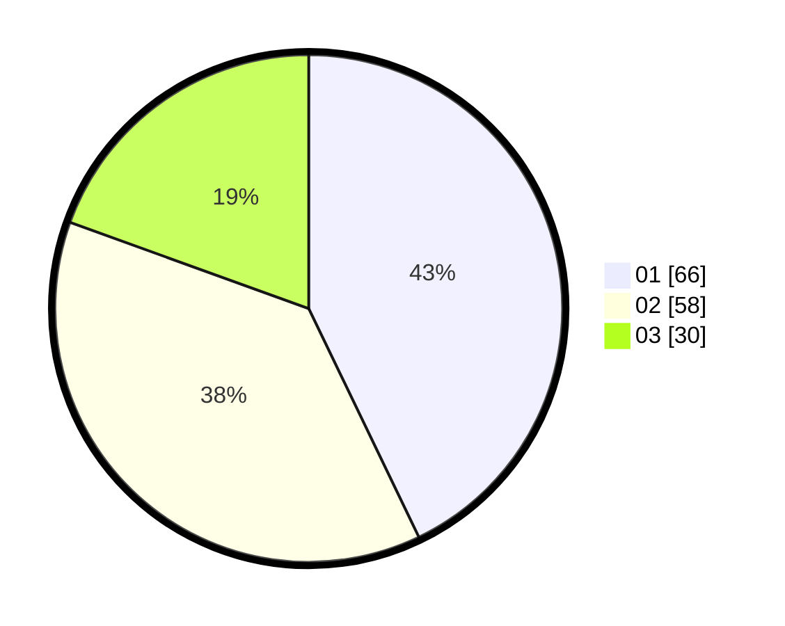

# Hasil

Hasil perolehan suara paslon dapat dilihat pada file paslon-01.txt, paslon-02.txt, dan paslon-03.txt.

Jika tidak ada, artinya data tersebut belum ada pada SIREKAP.

## Perolehan Suara

 * Paslon 01: **66**.
 * Paslon 02: **58**.
 * Paslon 03: **30**.

## Foto C Plano

https://sirekap-obj-formc.kpu.go.id/624b/pemilu/ppwp/31/74/06/10/01/3174061001176-20240214-235055--47ad9ddf-72f0-4ec2-a3f4-7a44d06d75fa.jpg

https://sirekap-obj-formc.kpu.go.id/624b/pemilu/ppwp/31/74/06/10/01/3174061001176-20240214-235156--d9aebc25-86ff-46c9-ae83-3618a26b7c12.jpg

https://sirekap-obj-formc.kpu.go.id/624b/pemilu/ppwp/31/74/06/10/01/3174061001176-20240214-235301--35929dfd-e4bf-4897-8509-0d233eb7d33e.jpg

## DATA PEMILIH TETAP

Jumlah pemilih dalam DPT: **199**.
 * L: **95**.
 * P: **104**.

## DATA PENGGUNA HAK PILIH

Jumlah pengguna hak pilih dalam DPT: **155**.
 * L: **73**.
 * P: **82**.

Jumlah pengguna hak pilih dalam DPTb: **0**.
 * L: **0**.
 * P: **0**.

Jumlah pengguna hak pilih dalam DPK: **2**.
 * L: **0**.
 * P: **2**.

Jumlah pengguna hak pilih: **157**.
 * L: **73**.
 * P: **84**.

## JUMLAH SUARA SAH DAN TIDAK SAH

JUMLAH SELURUH SUARA SAH: **154**.

JUMLAH SUARA TIDAK SAH: **3**.

JUMLAH SELURUH SUARA SAH DAN SUARA TIDAK SAH: **157**.
