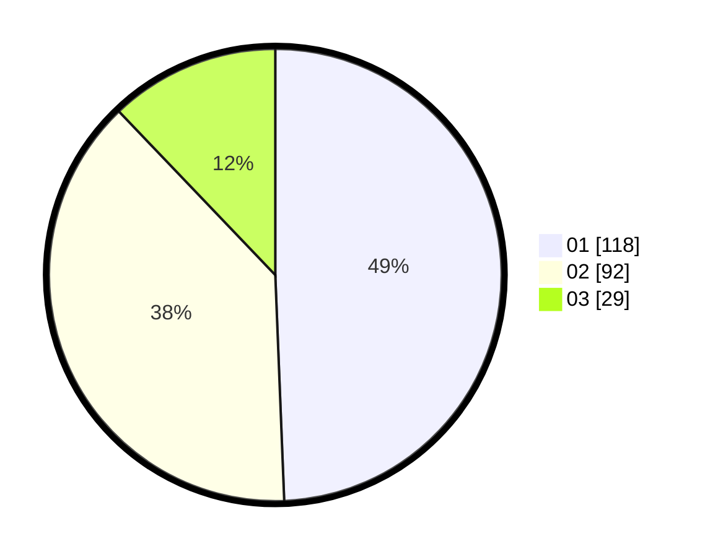

# Hasil

Hasil perolehan suara paslon dapat dilihat pada file paslon-01.txt, paslon-02.txt, dan paslon-03.txt.

Jika tidak ada, artinya data tersebut belum ada pada SIREKAP.

## Perolehan Suara

 * Paslon 01: **118**.
 * Paslon 02: **92**.
 * Paslon 03: **29**.

## Foto C Plano

https://sirekap-obj-formc.kpu.go.id/d738/pemilu/ppwp/31/74/06/10/02/3174061002007-20240214-220928--cc1db14e-8997-49ce-902c-dec2696f3a5b.jpg

https://sirekap-obj-formc.kpu.go.id/d738/pemilu/ppwp/31/74/06/10/02/3174061002007-20240215-213545--69b5667a-b814-4517-ad3d-545393be7783.jpg

https://sirekap-obj-formc.kpu.go.id/d738/pemilu/ppwp/31/74/06/10/02/3174061002007-20240214-220934--93067ed3-69ed-4641-93c7-b2b6a4d1f9ec.jpg

## DATA PEMILIH TETAP

Jumlah pemilih dalam DPT: **270**.
 * L: **132**.
 * P: **138**.

## DATA PENGGUNA HAK PILIH

Jumlah pengguna hak pilih dalam DPT: **236**.
 * L: **115**.
 * P: **121**.

Jumlah pengguna hak pilih dalam DPTb: **4**.
 * L: **2**.
 * P: **2**.

Jumlah pengguna hak pilih dalam DPK: **1**.
 * L: **0**.
 * P: **1**.

Jumlah pengguna hak pilih: **241**.
 * L: **117**.
 * P: **124**.

## JUMLAH SUARA SAH DAN TIDAK SAH

JUMLAH SELURUH SUARA SAH: **240**.

JUMLAH SUARA TIDAK SAH: **1**.

JUMLAH SELURUH SUARA SAH DAN SUARA TIDAK SAH: **241**.
