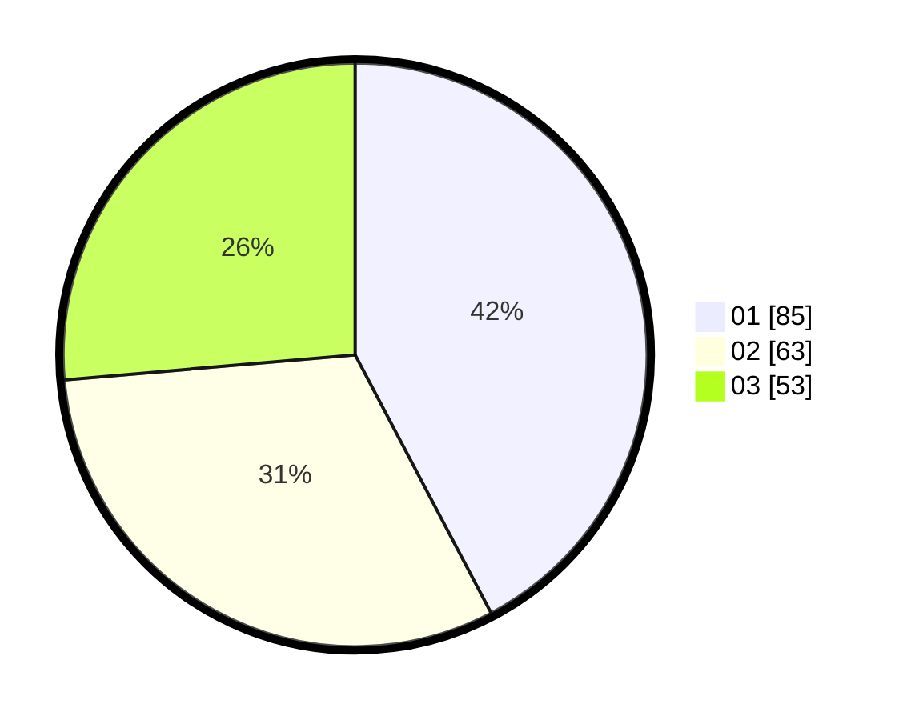

# Hasil

Hasil perolehan suara paslon dapat dilihat pada file paslon-01.txt, paslon-02.txt, dan paslon-03.txt.

Jika tidak ada, artinya data tersebut belum ada pada SIREKAP.

## Perolehan Suara

 * Paslon 01: **85**.
 * Paslon 02: **63**.
 * Paslon 03: **53**.

## Foto C Plano

https://sirekap-obj-formc.kpu.go.id/5d3f/pemilu/ppwp/31/74/06/10/02/3174061002012-20240215-160346--b5c044ea-f0bf-41a7-86ab-f55575467ad8.jpg

https://sirekap-obj-formc.kpu.go.id/5d3f/pemilu/ppwp/31/74/06/10/02/3174061002012-20240216-204722--e7ce07cd-4744-4391-9a9a-3655290b01d8.jpg

https://sirekap-obj-formc.kpu.go.id/5d3f/pemilu/ppwp/31/74/06/10/02/3174061002012-20240216-194902--9f08a63c-ec47-4007-887f-66c3a84e3fc8.jpg
