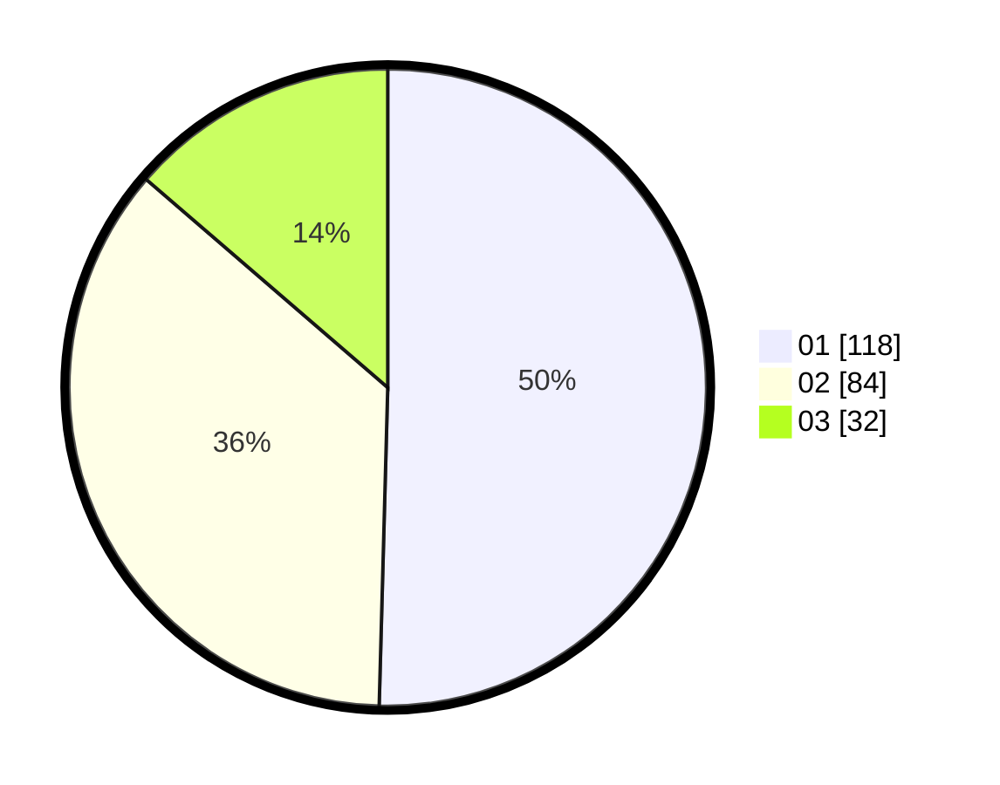

# Hasil

Hasil perolehan suara paslon dapat dilihat pada file paslon-01.txt, paslon-02.txt, dan paslon-03.txt.

Jika tidak ada, artinya data tersebut belum ada pada SIREKAP.

## Perolehan Suara

 * Paslon 01: **118**.
 * Paslon 02: **84**.
 * Paslon 03: **32**.

## Foto C Plano

https://sirekap-obj-formc.kpu.go.id/e527/pemilu/ppwp/31/74/06/10/02/3174061002032-20240214-155052--cf041f97-71ca-45d4-99cf-f1f57527c6f4.jpg

https://sirekap-obj-formc.kpu.go.id/e527/pemilu/ppwp/31/74/06/10/02/3174061002032-20240214-155105--6991bfc9-a61a-4018-baf6-9f4f5a2e1b83.jpg

https://sirekap-obj-formc.kpu.go.id/e527/pemilu/ppwp/31/74/06/10/02/3174061002032-20240214-155116--bdba135a-d997-4078-9846-21b965200449.jpg

## DATA PEMILIH TETAP

Jumlah pemilih dalam DPT: **298**.
 * L: **143**.
 * P: **155**.

## DATA PENGGUNA HAK PILIH

Jumlah pengguna hak pilih dalam DPT: **233**.
 * L: **109**.
 * P: **124**.

Jumlah pengguna hak pilih dalam DPTb: **1**.
 * L: **1**.
 * P: **0**.

Jumlah pengguna hak pilih dalam DPK: **2**.
 * L: **1**.
 * P: **1**.

Jumlah pengguna hak pilih: **236**.
 * L: **111**.
 * P: **125**.

## JUMLAH SUARA SAH DAN TIDAK SAH

JUMLAH SELURUH SUARA SAH: **234**.

JUMLAH SUARA TIDAK SAH: **2**.

JUMLAH SELURUH SUARA SAH DAN SUARA TIDAK SAH: **236**.
