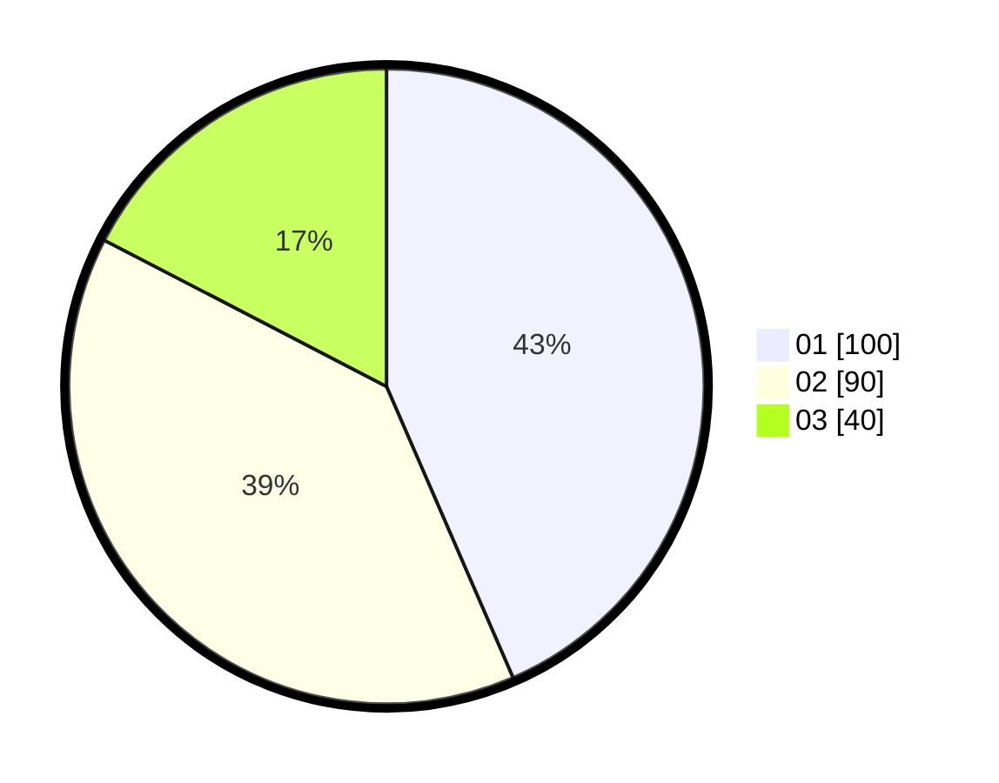

# Hasil

Hasil perolehan suara paslon dapat dilihat pada file paslon-01.txt, paslon-02.txt, dan paslon-03.txt.

Jika tidak ada, artinya data tersebut belum ada pada SIREKAP.

## Perolehan Suara

 * Paslon 01: **100**.
 * Paslon 02: **90**.
 * Paslon 03: **40**.

## Foto C Plano

https://sirekap-obj-formc.kpu.go.id/cea3/pemilu/ppwp/31/74/06/10/02/3174061002035-20240217-104249--edfc4528-8dea-4e8f-a129-3a53f9e50b3e.jpg

https://sirekap-obj-formc.kpu.go.id/cea3/pemilu/ppwp/31/74/06/10/02/3174061002035-20240217-104355--216e8394-d3dc-48de-b859-96bcfa2f6be7.jpg

https://sirekap-obj-formc.kpu.go.id/cea3/pemilu/ppwp/31/74/06/10/02/3174061002035-20240217-104457--bec7f07e-8e50-4ef3-ad07-38f89351bcce.jpg

## DATA PEMILIH TETAP

Jumlah pemilih dalam DPT: **298**.
 * L: **748**.
 * P: **120**.

## DATA PENGGUNA HAK PILIH

Jumlah pengguna hak pilih dalam DPT: **225**.
 * L: **212**.
 * P: **112**.

Jumlah pengguna hak pilih dalam DPTb: **10**.
 * L: **4**.
 * P: **806**.

Jumlah pengguna hak pilih dalam DPK: **2**.
 * L: **0**.
 * P: **2**.

Jumlah pengguna hak pilih: **235**.
 * L: **116**.
 * P: **119**.

## JUMLAH SUARA SAH DAN TIDAK SAH

JUMLAH SELURUH SUARA SAH: **230**.

JUMLAH SUARA TIDAK SAH: **5**.

JUMLAH SELURUH SUARA SAH DAN SUARA TIDAK SAH: **235**.
