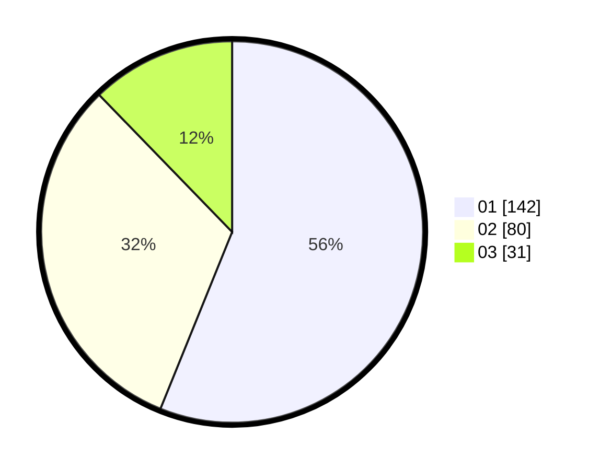

# Hasil

Hasil perolehan suara paslon dapat dilihat pada file paslon-01.txt, paslon-02.txt, dan paslon-03.txt.

Jika tidak ada, artinya data tersebut belum ada pada SIREKAP.

## Perolehan Suara

 * Paslon 01: **142**.
 * Paslon 02: **80**.
 * Paslon 03: **31**.

## Foto C Plano

https://sirekap-obj-formc.kpu.go.id/de44/pemilu/ppwp/31/74/06/10/02/3174061002037-20240217-104935--4d0bee14-0228-42cd-aa76-5ed97c45df72.jpg

https://sirekap-obj-formc.kpu.go.id/de44/pemilu/ppwp/31/74/06/10/02/3174061002037-20240217-104732--40ae2c70-154f-4dd0-9e0a-a6ad3beae198.jpg

https://sirekap-obj-formc.kpu.go.id/de44/pemilu/ppwp/31/74/06/10/02/3174061002037-20240217-104829--540c536f-f92e-4916-9106-50da6d4a79e5.jpg

## DATA PEMILIH TETAP

Jumlah pemilih dalam DPT: **298**.
 * L: **148**.
 * P: **150**.

## DATA PENGGUNA HAK PILIH

Jumlah pengguna hak pilih dalam DPT: **241**.
 * L: **116**.
 * P: **125**.

Jumlah pengguna hak pilih dalam DPTb: **15**.
 * L: **0**.
 * P: **15**.

Jumlah pengguna hak pilih dalam DPK: **1**.
 * L: **0**.
 * P: **1**.

Jumlah pengguna hak pilih: **257**.
 * L: **116**.
 * P: **141**.

## JUMLAH SUARA SAH DAN TIDAK SAH

JUMLAH SELURUH SUARA SAH: **253**.

JUMLAH SUARA TIDAK SAH: **4**.

JUMLAH SELURUH SUARA SAH DAN SUARA TIDAK SAH: **257**.
