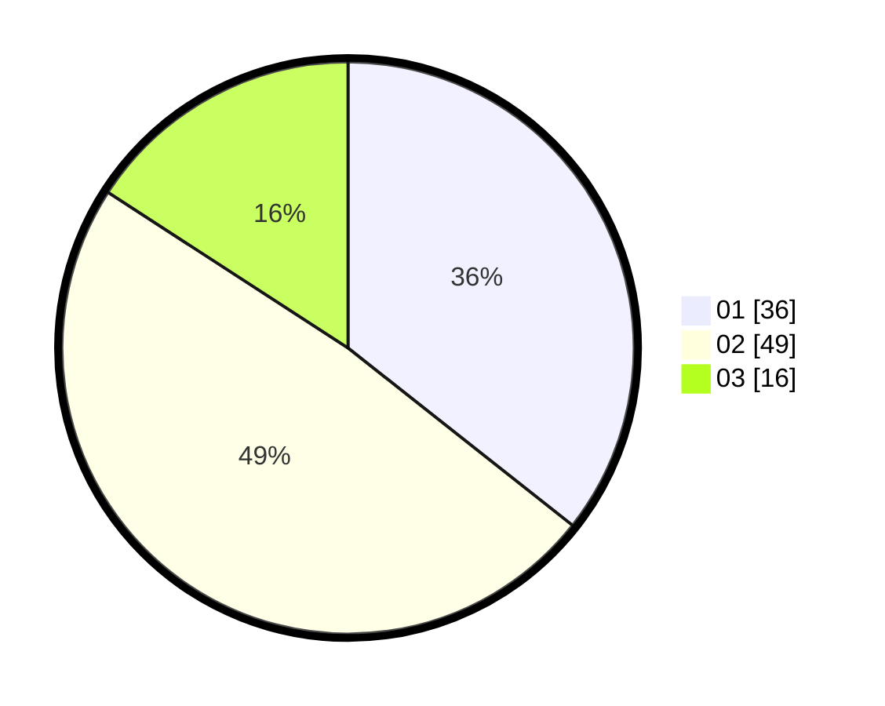

# Hasil

Hasil perolehan suara paslon dapat dilihat pada file paslon-01.txt, paslon-02.txt, dan paslon-03.txt.

Jika tidak ada, artinya data tersebut belum ada pada SIREKAP.

## Perolehan Suara

 * Paslon 01: **36**.
 * Paslon 02: **49**.
 * Paslon 03: **16**.

## Foto C Plano

https://sirekap-obj-formc.kpu.go.id/0595/pemilu/ppwp/31/74/06/10/02/3174061002039-20240217-105102--2c556255-acca-4f04-b1f0-6c4df29d58d8.jpg

https://sirekap-obj-formc.kpu.go.id/0595/pemilu/ppwp/31/74/06/10/02/3174061002039-20240217-105220--a4ce6655-d799-4db5-ad69-bbe1929302ad.jpg

https://sirekap-obj-formc.kpu.go.id/0595/pemilu/ppwp/31/74/06/10/02/3174061002039-20240217-105320--df933c38-b765-4767-ae6d-e4596324c0aa.jpg

## DATA PEMILIH TETAP

Jumlah pemilih dalam DPT: **107**.
 * L: **52**.
 * P: **55**.

## DATA PENGGUNA HAK PILIH

Jumlah pengguna hak pilih dalam DPT: **90**.
 * L: **45**.
 * P: **45**.

Jumlah pengguna hak pilih dalam DPTb: **4**.
 * L: **2**.
 * P: **2**.

Jumlah pengguna hak pilih dalam DPK: **7**.
 * L: **3**.
 * P: **4**.

Jumlah pengguna hak pilih: **101**.
 * L: **50**.
 * P: **51**.

## JUMLAH SUARA SAH DAN TIDAK SAH

JUMLAH SELURUH SUARA SAH: **101**.

JUMLAH SUARA TIDAK SAH: **0**.

JUMLAH SELURUH SUARA SAH DAN SUARA TIDAK SAH: **101**.
