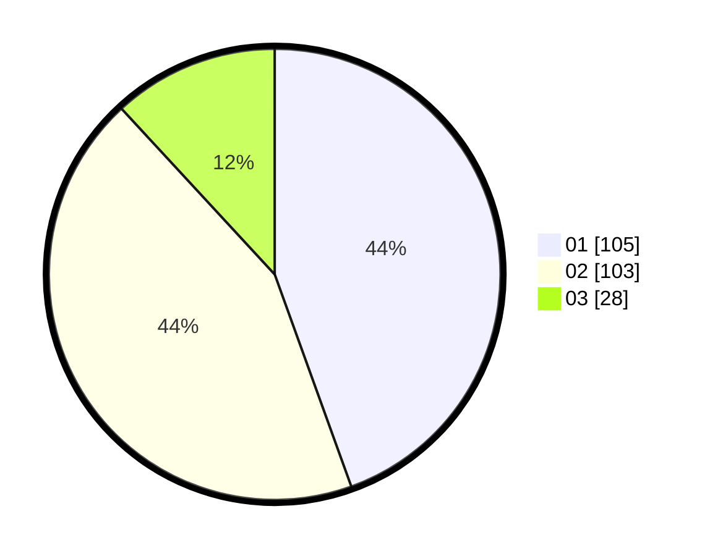

# Hasil

Hasil perolehan suara paslon dapat dilihat pada file paslon-01.txt, paslon-02.txt, dan paslon-03.txt.

Jika tidak ada, artinya data tersebut belum ada pada SIREKAP.

## Perolehan Suara

 * Paslon 01: **105**.
 * Paslon 02: **103**.
 * Paslon 03: **28**.

## Foto C Plano

https://sirekap-obj-formc.kpu.go.id/1f5e/pemilu/ppwp/31/74/06/10/02/3174061002040-20240217-131826--96d58b03-dcaf-44a1-8c98-2f9224335edc.jpg

https://sirekap-obj-formc.kpu.go.id/1f5e/pemilu/ppwp/31/74/06/10/02/3174061002040-20240217-131930--6f0c8fc3-cd84-4a30-a2cd-56b8fc8c4633.jpg

https://sirekap-obj-formc.kpu.go.id/1f5e/pemilu/ppwp/31/74/06/10/02/3174061002040-20240217-132140--098d3e5d-6c59-4353-85c6-473c0b07c1fb.jpg

## DATA PEMILIH TETAP

Jumlah pemilih dalam DPT: **290**.
 * L: **149**.
 * P: **141**.

## DATA PENGGUNA HAK PILIH

Jumlah pengguna hak pilih dalam DPT: **235**.
 * L: **118**.
 * P: **117**.

Jumlah pengguna hak pilih dalam DPTb: **3**.
 * L: **3**.
 * P: **0**.

Jumlah pengguna hak pilih dalam DPK: **1**.
 * L: **0**.
 * P: **1**.

Jumlah pengguna hak pilih: **239**.
 * L: **121**.
 * P: **118**.

## JUMLAH SUARA SAH DAN TIDAK SAH

JUMLAH SELURUH SUARA SAH: **236**.

JUMLAH SUARA TIDAK SAH: **3**.

JUMLAH SELURUH SUARA SAH DAN SUARA TIDAK SAH: **239**.
