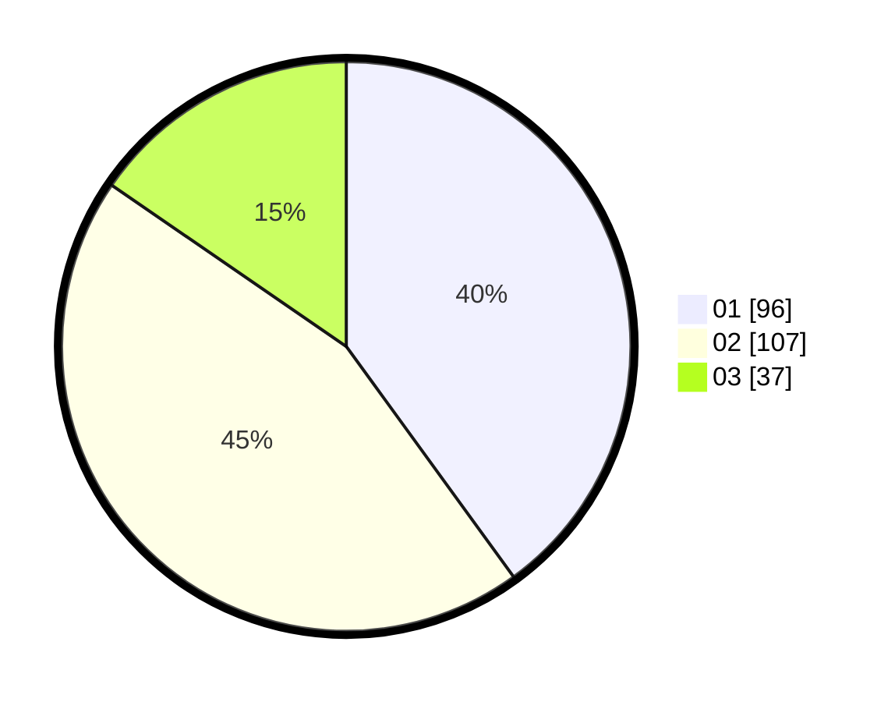

# Hasil

Hasil perolehan suara paslon dapat dilihat pada file paslon-01.txt, paslon-02.txt, dan paslon-03.txt.

Jika tidak ada, artinya data tersebut belum ada pada SIREKAP.

## Perolehan Suara

 * Paslon 01: **96**.
 * Paslon 02: **107**.
 * Paslon 03: **37**.

## Foto C Plano

https://sirekap-obj-formc.kpu.go.id/ee25/pemilu/ppwp/31/74/06/10/02/3174061002041-20240217-132812--7c8858ee-f60a-4b50-98c8-926a0cf86162.jpg

https://sirekap-obj-formc.kpu.go.id/ee25/pemilu/ppwp/31/74/06/10/02/3174061002041-20240217-132441--24fff0e5-d897-4000-b4c2-a1752838e3a2.jpg

https://sirekap-obj-formc.kpu.go.id/ee25/pemilu/ppwp/31/74/06/10/02/3174061002041-20240217-132538--0e7aa274-7f16-4a5f-8261-e74af19498dc.jpg

## DATA PEMILIH TETAP

Jumlah pemilih dalam DPT: **294**.
 * L: **141**.
 * P: **154**.

## DATA PENGGUNA HAK PILIH

Jumlah pengguna hak pilih dalam DPT: **277**.
 * L: **104**.
 * P: **177**.

Jumlah pengguna hak pilih dalam DPTb: **6**.
 * L: **0**.
 * P: **2**.

Jumlah pengguna hak pilih dalam DPK: **4**.
 * L: **1**.
 * P: **7**.

Jumlah pengguna hak pilih: **247**.
 * L: **105**.
 * P: **178**.

## JUMLAH SUARA SAH DAN TIDAK SAH

JUMLAH SELURUH SUARA SAH: **240**.

JUMLAH SUARA TIDAK SAH: **3**.

JUMLAH SELURUH SUARA SAH DAN SUARA TIDAK SAH: **243**.
