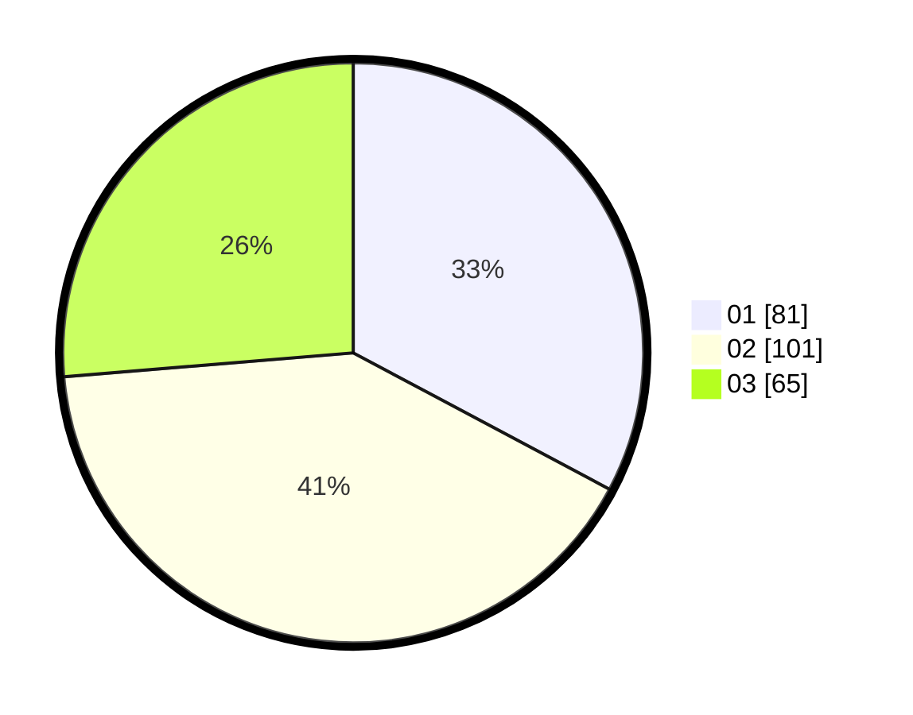

# Hasil

Hasil perolehan suara paslon dapat dilihat pada file paslon-01.txt, paslon-02.txt, dan paslon-03.txt.

Jika tidak ada, artinya data tersebut belum ada pada SIREKAP.

## Perolehan Suara

 * Paslon 01: **81**.
 * Paslon 02: **101**.
 * Paslon 03: **65**.

## Foto C Plano

https://sirekap-obj-formc.kpu.go.id/b4aa/pemilu/ppwp/31/74/06/10/02/3174061002048-20240214-155157--1d49e439-8d4a-4c72-a593-47962d2024f8.jpg

https://sirekap-obj-formc.kpu.go.id/b4aa/pemilu/ppwp/31/74/06/10/02/3174061002048-20240214-155400--09a20a9f-8be8-492e-9fcb-3f02e78540d2.jpg

https://sirekap-obj-formc.kpu.go.id/b4aa/pemilu/ppwp/31/74/06/10/02/3174061002048-20240214-155258--f4577139-8b82-4a42-8e6a-29e4011135fa.jpg
