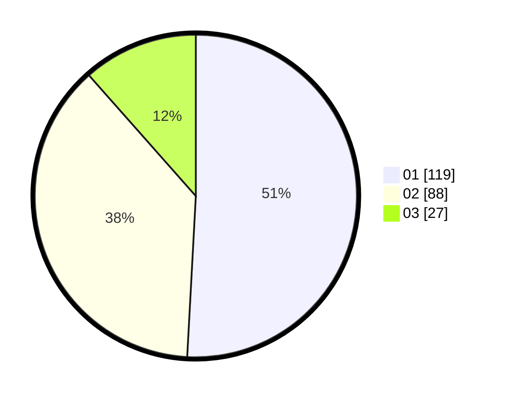

# Hasil

Hasil perolehan suara paslon dapat dilihat pada file paslon-01.txt, paslon-02.txt, dan paslon-03.txt.

Jika tidak ada, artinya data tersebut belum ada pada SIREKAP.

## Perolehan Suara

 * Paslon 01: **119**.
 * Paslon 02: **88**.
 * Paslon 03: **27**.

## Foto C Plano

https://sirekap-obj-formc.kpu.go.id/7a9a/pemilu/ppwp/31/74/06/10/02/3174061002053-20240217-113244--917c8166-04a3-41bd-8a02-b3175f95b86b.jpg

https://sirekap-obj-formc.kpu.go.id/7a9a/pemilu/ppwp/31/74/06/10/02/3174061002053-20240217-113346--95cf1343-bb67-44a4-b7b7-ad00cc53941a.jpg

https://sirekap-obj-formc.kpu.go.id/7a9a/pemilu/ppwp/31/74/06/10/02/3174061002053-20240217-113447--b88d5b82-50fe-4d5e-9ddc-182745bb383b.jpg

## DATA PEMILIH TETAP

Jumlah pemilih dalam DPT: **295**.
 * L: **744**.
 * P: **757**.

## DATA PENGGUNA HAK PILIH

Jumlah pengguna hak pilih dalam DPT: **235**.
 * L: **111**.
 * P: **124**.

Jumlah pengguna hak pilih dalam DPTb: **2**.
 * L: **1**.
 * P: **1**.

Jumlah pengguna hak pilih dalam DPK: **2**.
 * L: **0**.
 * P: **2**.

Jumlah pengguna hak pilih: **239**.
 * L: **172**.
 * P: **127**.

## JUMLAH SUARA SAH DAN TIDAK SAH

JUMLAH SELURUH SUARA SAH: **234**.

JUMLAH SUARA TIDAK SAH: **5**.

JUMLAH SELURUH SUARA SAH DAN SUARA TIDAK SAH: **239**.
