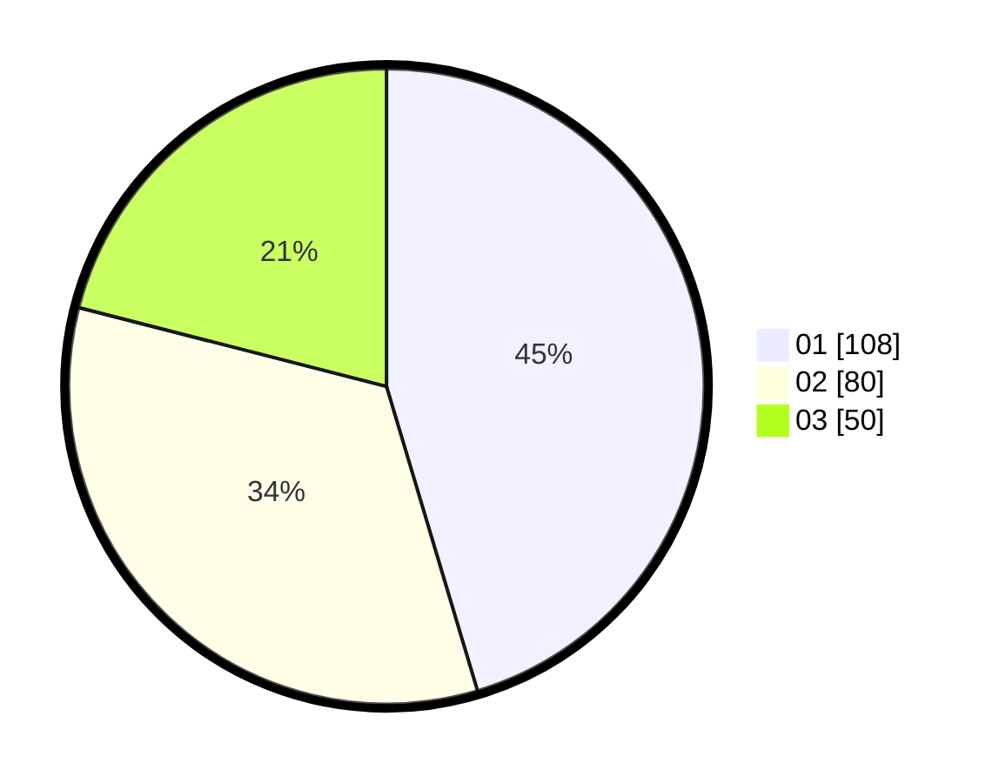

# Hasil

Hasil perolehan suara paslon dapat dilihat pada file paslon-01.txt, paslon-02.txt, dan paslon-03.txt.

Jika tidak ada, artinya data tersebut belum ada pada SIREKAP.

## Perolehan Suara

 * Paslon 01: **108**.
 * Paslon 02: **80**.
 * Paslon 03: **50**.

## Foto C Plano

https://sirekap-obj-formc.kpu.go.id/30cf/pemilu/ppwp/31/74/06/10/02/3174061002054-20240217-114853--34ea3dfd-7abe-468b-978b-4ed60ee0c4ef.jpg

https://sirekap-obj-formc.kpu.go.id/30cf/pemilu/ppwp/31/74/06/10/02/3174061002054-20240217-114937--ee38f7c1-8d54-4973-a3e9-28468d4eab35.jpg

https://sirekap-obj-formc.kpu.go.id/30cf/pemilu/ppwp/31/74/06/10/02/3174061002054-20240217-115134--1ceb043e-c0e6-4cf4-b5e7-23e28001a74e.jpg

## DATA PEMILIH TETAP

Jumlah pemilih dalam DPT: **240**.
 * L: **115**.
 * P: **125**.

## DATA PENGGUNA HAK PILIH

Jumlah pengguna hak pilih dalam DPT: **240**.
 * L: **113**.
 * P: **217**.

Jumlah pengguna hak pilih dalam DPTb: **7**.
 * L: **2**.
 * P: **5**.

Jumlah pengguna hak pilih dalam DPK: **3**.
 * L: **0**.
 * P: **3**.

Jumlah pengguna hak pilih: **240**.
 * L: **115**.
 * P: **124**.

## JUMLAH SUARA SAH DAN TIDAK SAH

JUMLAH SELURUH SUARA SAH: **238**.

JUMLAH SUARA TIDAK SAH: **1**.

JUMLAH SELURUH SUARA SAH DAN SUARA TIDAK SAH: **239**.
