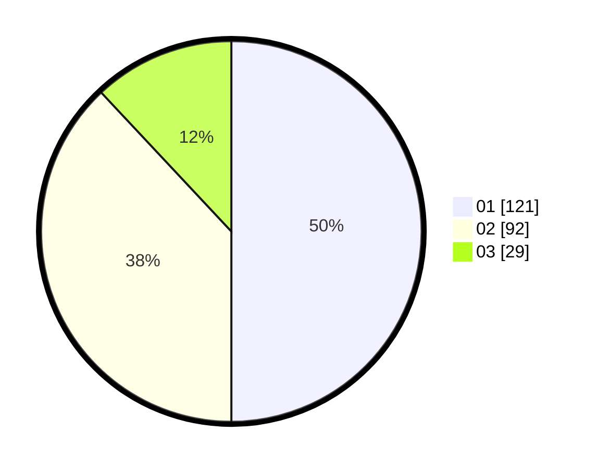

# Hasil

Hasil perolehan suara paslon dapat dilihat pada file paslon-01.txt, paslon-02.txt, dan paslon-03.txt.

Jika tidak ada, artinya data tersebut belum ada pada SIREKAP.

## Perolehan Suara

 * Paslon 01: **121**.
 * Paslon 02: **92**.
 * Paslon 03: **29**.

## Foto C Plano

https://sirekap-obj-formc.kpu.go.id/8d87/pemilu/ppwp/31/74/06/10/02/3174061002061-20240214-155135--65598bcf-4e86-449d-a9d2-d178421e374e.jpg

https://sirekap-obj-formc.kpu.go.id/8d87/pemilu/ppwp/31/74/06/10/02/3174061002061-20240214-155120--2ec36d20-ec6e-40b9-a7ad-6197cc573b58.jpg

https://sirekap-obj-formc.kpu.go.id/8d87/pemilu/ppwp/31/74/06/10/02/3174061002061-20240214-155050--0c0becdd-6e33-4618-a5bc-9300c5a1ef10.jpg

## DATA PEMILIH TETAP

Jumlah pemilih dalam DPT: **299**.
 * L: **154**.
 * P: **145**.

## DATA PENGGUNA HAK PILIH

Jumlah pengguna hak pilih dalam DPT: **236**.
 * L: **112**.
 * P: **124**.

Jumlah pengguna hak pilih dalam DPTb: **5**.
 * L: **2**.
 * P: **3**.

Jumlah pengguna hak pilih dalam DPK: **1**.
 * L: **1**.
 * P: **0**.

Jumlah pengguna hak pilih: **242**.
 * L: **115**.
 * P: **127**.

## JUMLAH SUARA SAH DAN TIDAK SAH

JUMLAH SELURUH SUARA SAH: **242**.

JUMLAH SUARA TIDAK SAH: **0**.

JUMLAH SELURUH SUARA SAH DAN SUARA TIDAK SAH: **242**.
