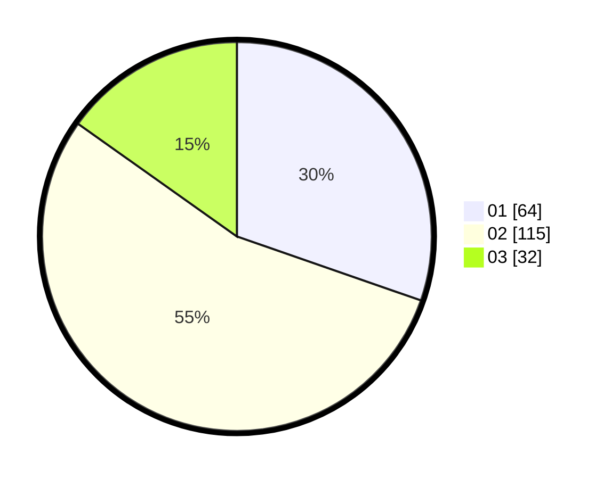

# Hasil

Hasil perolehan suara paslon dapat dilihat pada file paslon-01.txt, paslon-02.txt, dan paslon-03.txt.

Jika tidak ada, artinya data tersebut belum ada pada SIREKAP.

## Perolehan Suara

 * Paslon 01: **64**.
 * Paslon 02: **115**.
 * Paslon 03: **32**.

## Foto C Plano

https://sirekap-obj-formc.kpu.go.id/18f5/pemilu/ppwp/31/74/06/10/02/3174061002068-20240218-174615--c1da5e03-ec0b-46e6-94e0-b75932193b49.jpg

https://sirekap-obj-formc.kpu.go.id/18f5/pemilu/ppwp/31/74/06/10/02/3174061002068-20240218-174637--25039d3f-ba14-4da0-807f-359b73859931.jpg

https://sirekap-obj-formc.kpu.go.id/18f5/pemilu/ppwp/31/74/06/10/02/3174061002068-20240218-174707--b6cdbf04-12d0-486c-90af-4e1ec2033b62.jpg

## DATA PEMILIH TETAP

Jumlah pemilih dalam DPT: **295**.
 * L: **161**.
 * P: **134**.

## DATA PENGGUNA HAK PILIH

Jumlah pengguna hak pilih dalam DPT: **210**.
 * L: **105**.
 * P: **105**.

Jumlah pengguna hak pilih dalam DPTb: **2**.
 * L: **1**.
 * P: **1**.

Jumlah pengguna hak pilih dalam DPK: **3**.
 * L: **1**.
 * P: **2**.

Jumlah pengguna hak pilih: **215**.
 * L: **107**.
 * P: **108**.

## JUMLAH SUARA SAH DAN TIDAK SAH

JUMLAH SELURUH SUARA SAH: **211**.

JUMLAH SUARA TIDAK SAH: **4**.

JUMLAH SELURUH SUARA SAH DAN SUARA TIDAK SAH: **215**.
