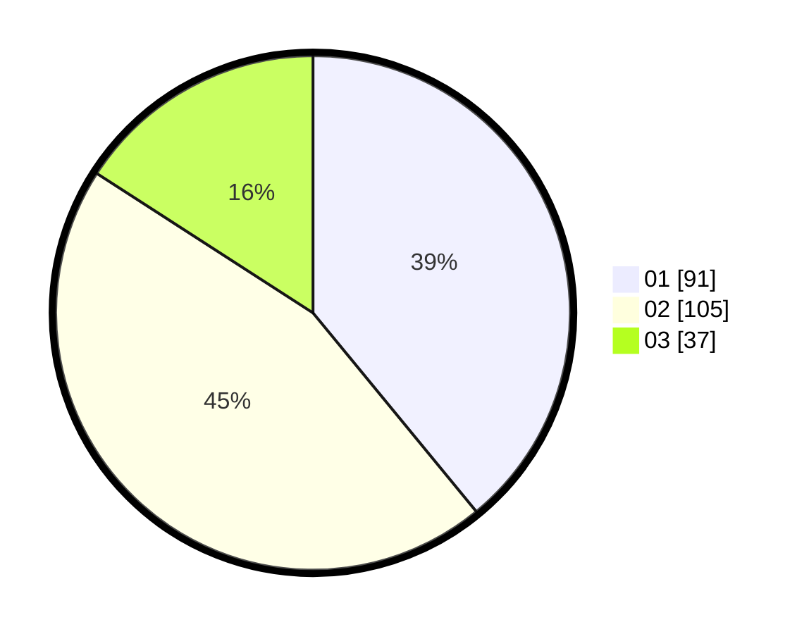

# Hasil

Hasil perolehan suara paslon dapat dilihat pada file paslon-01.txt, paslon-02.txt, dan paslon-03.txt.

Jika tidak ada, artinya data tersebut belum ada pada SIREKAP.

## Perolehan Suara

 * Paslon 01: **91**.
 * Paslon 02: **105**.
 * Paslon 03: **37**.

## Foto C Plano

https://sirekap-obj-formc.kpu.go.id/361f/pemilu/ppwp/31/74/06/10/02/3174061002069-20240218-162516--dd9da0ae-749e-415a-98c7-e237ed3605de.jpg

https://sirekap-obj-formc.kpu.go.id/361f/pemilu/ppwp/31/74/06/10/02/3174061002069-20240218-162738--26407d5e-8491-41a5-a467-3851be2e1cc9.jpg

https://sirekap-obj-formc.kpu.go.id/361f/pemilu/ppwp/31/74/06/10/02/3174061002069-20240218-162812--ee262e5e-7df1-49f3-9e39-2bfdc25adea6.jpg

## DATA PEMILIH TETAP

Jumlah pemilih dalam DPT: **232**.
 * L: **111**.
 * P: **121**.

## DATA PENGGUNA HAK PILIH

Jumlah pengguna hak pilih dalam DPT: **232**.
 * L: **111**.
 * P: **121**.

Jumlah pengguna hak pilih dalam DPTb: **101**.
 * L: **0**.
 * P: **8**.

Jumlah pengguna hak pilih dalam DPK: **5**.
 * L: **3**.
 * P: **2**.

Jumlah pengguna hak pilih: **238**.
 * L: **119**.
 * P: **124**.

## JUMLAH SUARA SAH DAN TIDAK SAH

JUMLAH SELURUH SUARA SAH: **233**.

JUMLAH SUARA TIDAK SAH: **5**.

JUMLAH SELURUH SUARA SAH DAN SUARA TIDAK SAH: **238**.
