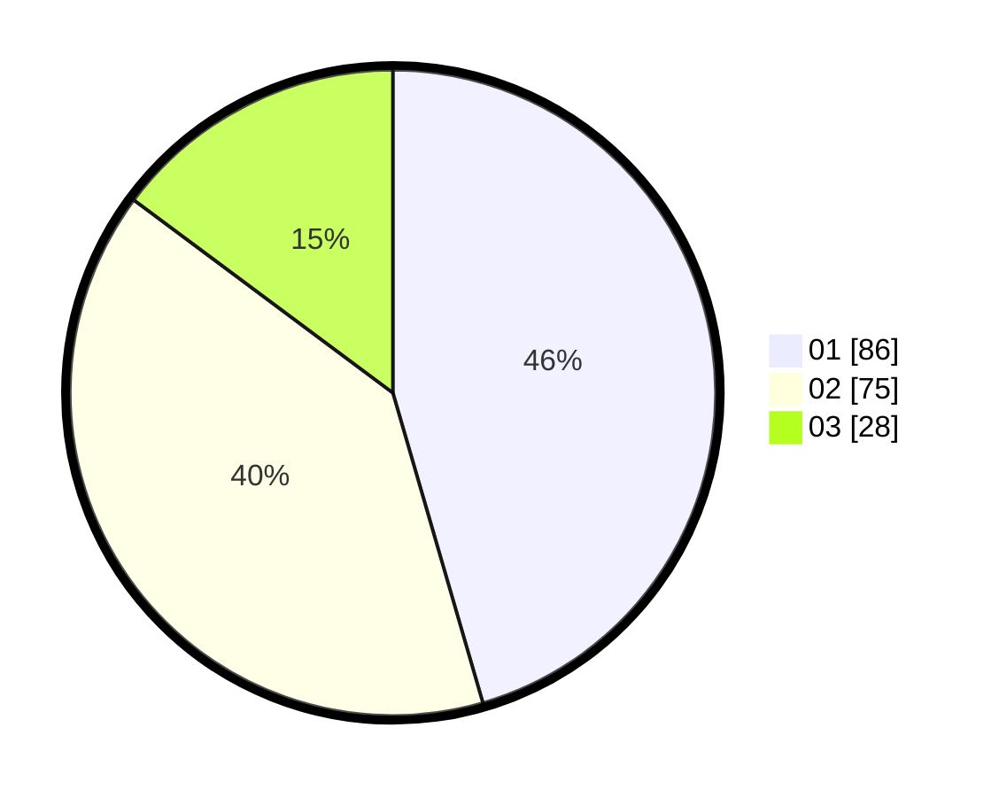

# Hasil

Hasil perolehan suara paslon dapat dilihat pada file paslon-01.txt, paslon-02.txt, dan paslon-03.txt.

Jika tidak ada, artinya data tersebut belum ada pada SIREKAP.

## Perolehan Suara

 * Paslon 01: **86**.
 * Paslon 02: **75**.
 * Paslon 03: **28**.

## Foto C Plano

https://sirekap-obj-formc.kpu.go.id/8b06/pemilu/ppwp/31/74/06/10/02/3174061002070-20240214-201049--a3399da7-f43e-442b-a1f4-2e686ec9d9e8.jpg

https://sirekap-obj-formc.kpu.go.id/8b06/pemilu/ppwp/31/74/06/10/02/3174061002070-20240214-201146--65828abe-40af-4cfe-9a74-0dab33d46f8b.jpg

https://sirekap-obj-formc.kpu.go.id/8b06/pemilu/ppwp/31/74/06/10/02/3174061002070-20240214-201340--3dce582b-7d0d-4d9c-b169-2bcc30025f42.jpg

## DATA PEMILIH TETAP

Jumlah pemilih dalam DPT: **235**.
 * L: **114**.
 * P: **121**.

## DATA PENGGUNA HAK PILIH

Jumlah pengguna hak pilih dalam DPT: **188**.
 * L: **85**.
 * P: **103**.

Jumlah pengguna hak pilih dalam DPTb: **1**.
 * L: **0**.
 * P: **1**.

Jumlah pengguna hak pilih dalam DPK: **2**.
 * L: **1**.
 * P: **1**.

Jumlah pengguna hak pilih: **191**.
 * L: **86**.
 * P: **105**.

## JUMLAH SUARA SAH DAN TIDAK SAH

JUMLAH SELURUH SUARA SAH: **189**.

JUMLAH SUARA TIDAK SAH: **2**.

JUMLAH SELURUH SUARA SAH DAN SUARA TIDAK SAH: **191**.
