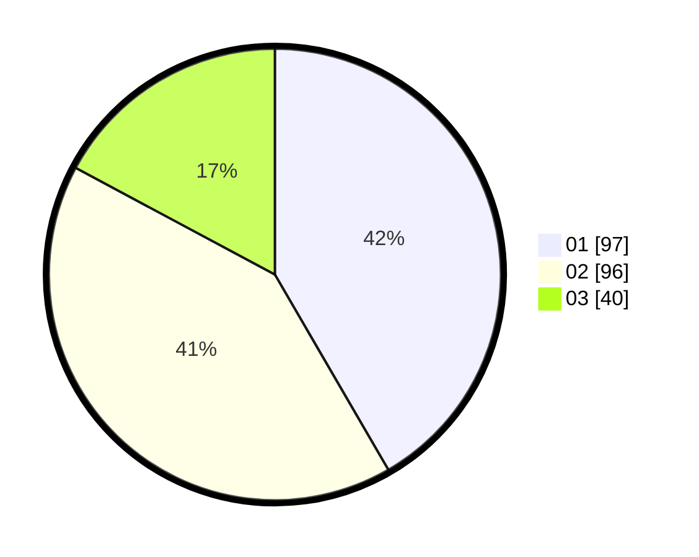

# Hasil

Hasil perolehan suara paslon dapat dilihat pada file paslon-01.txt, paslon-02.txt, dan paslon-03.txt.

Jika tidak ada, artinya data tersebut belum ada pada SIREKAP.

## Perolehan Suara

 * Paslon 01: **97**.
 * Paslon 02: **96**.
 * Paslon 03: **40**.

## Foto C Plano

https://sirekap-obj-formc.kpu.go.id/c6e9/pemilu/ppwp/31/74/06/10/02/3174061002083-20240214-192833--a6b3c66f-40c8-4c40-96aa-ad3123ac1715.jpg

https://sirekap-obj-formc.kpu.go.id/c6e9/pemilu/ppwp/31/74/06/10/02/3174061002083-20240214-192215--7c7b20ed-b7a1-4fc5-af21-00a3000c0d04.jpg

https://sirekap-obj-formc.kpu.go.id/c6e9/pemilu/ppwp/31/74/06/10/02/3174061002083-20240214-192229--45fadf5e-0ac8-4d19-a460-c51566c87d03.jpg

## DATA PEMILIH TETAP

Jumlah pemilih dalam DPT: **294**.
 * L: **134**.
 * P: **160**.

## DATA PENGGUNA HAK PILIH

Jumlah pengguna hak pilih dalam DPT: **221**.
 * L: **96**.
 * P: **125**.

Jumlah pengguna hak pilih dalam DPTb: **5**.
 * L: **4**.
 * P: **1**.

Jumlah pengguna hak pilih dalam DPK: **7**.
 * L: **3**.
 * P: **4**.

Jumlah pengguna hak pilih: **233**.
 * L: **103**.
 * P: **130**.

## JUMLAH SUARA SAH DAN TIDAK SAH

JUMLAH SELURUH SUARA SAH: **233**.

JUMLAH SUARA TIDAK SAH: **2**.

JUMLAH SELURUH SUARA SAH DAN SUARA TIDAK SAH: **235**.
