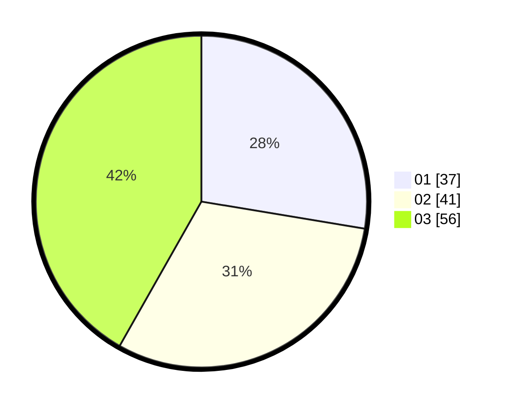

# Hasil

Hasil perolehan suara paslon dapat dilihat pada file paslon-01.txt, paslon-02.txt, dan paslon-03.txt.

Jika tidak ada, artinya data tersebut belum ada pada SIREKAP.

## Perolehan Suara

 * Paslon 01: **37**.
 * Paslon 02: **41**.
 * Paslon 03: **56**.

## Foto C Plano

https://sirekap-obj-formc.kpu.go.id/b388/pemilu/ppwp/31/74/06/10/02/3174061002087-20240214-213707--ea4c9d88-f775-40dd-922a-0e5427167b07.jpg

https://sirekap-obj-formc.kpu.go.id/b388/pemilu/ppwp/31/74/06/10/02/3174061002087-20240215-090716--d504f8e8-196a-417b-9923-a86f5033e625.jpg

https://sirekap-obj-formc.kpu.go.id/b388/pemilu/ppwp/31/74/06/10/02/3174061002087-20240214-213949--d9af589f-b5e3-4c41-863b-1744781fb0fd.jpg

## DATA PEMILIH TETAP

Jumlah pemilih dalam DPT: **164**.
 * L: **75**.
 * P: **89**.

## DATA PENGGUNA HAK PILIH

Jumlah pengguna hak pilih dalam DPT: **135**.
 * L: **62**.
 * P: **73**.

Jumlah pengguna hak pilih dalam DPTb: **0**.
 * L: **0**.
 * P: **0**.

Jumlah pengguna hak pilih dalam DPK: **4**.
 * L: **3**.
 * P: **1**.

Jumlah pengguna hak pilih: **139**.
 * L: **65**.
 * P: **74**.

## JUMLAH SUARA SAH DAN TIDAK SAH

JUMLAH SELURUH SUARA SAH: **134**.

JUMLAH SUARA TIDAK SAH: **5**.

JUMLAH SELURUH SUARA SAH DAN SUARA TIDAK SAH: **139**.
