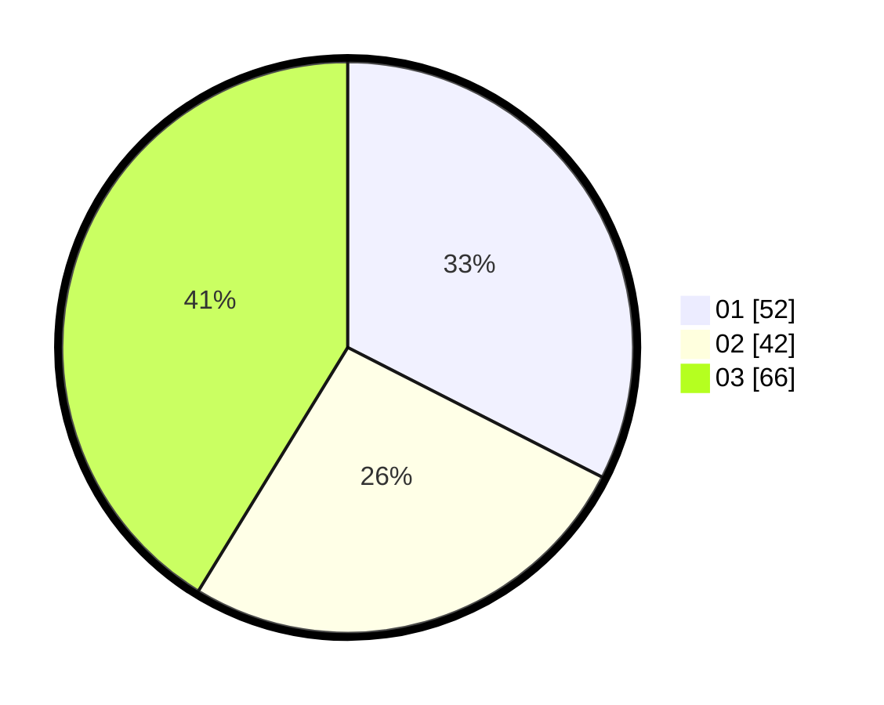

# Hasil

Hasil perolehan suara paslon dapat dilihat pada file paslon-01.txt, paslon-02.txt, dan paslon-03.txt.

Jika tidak ada, artinya data tersebut belum ada pada SIREKAP.

## Perolehan Suara

 * Paslon 01: **52**.
 * Paslon 02: **42**.
 * Paslon 03: **66**.

## Foto C Plano

https://sirekap-obj-formc.kpu.go.id/f2c6/pemilu/ppwp/31/74/06/10/02/3174061002088-20240218-163211--7a197c34-42c8-4a9a-a5ed-ce8490285966.jpg

https://sirekap-obj-formc.kpu.go.id/f2c6/pemilu/ppwp/31/74/06/10/02/3174061002088-20240218-163358--8052d8c2-5566-40b8-a00a-9331aab43aac.jpg

https://sirekap-obj-formc.kpu.go.id/f2c6/pemilu/ppwp/31/74/06/10/02/3174061002088-20240218-163512--56555d2b-2ecf-4eec-aeb4-a49f1f218d94.jpg

## DATA PEMILIH TETAP

Jumlah pemilih dalam DPT: **180**.
 * L: **80**.
 * P: **100**.

## DATA PENGGUNA HAK PILIH

Jumlah pengguna hak pilih dalam DPT: **151**.
 * L: **68**.
 * P: **83**.

Jumlah pengguna hak pilih dalam DPTb: **8**.
 * L: **2**.
 * P: **6**.

Jumlah pengguna hak pilih dalam DPK: **3**.
 * L: **1**.
 * P: **2**.

Jumlah pengguna hak pilih: **162**.
 * L: **71**.
 * P: **91**.

## JUMLAH SUARA SAH DAN TIDAK SAH

JUMLAH SELURUH SUARA SAH: **160**.

JUMLAH SUARA TIDAK SAH: **2**.

JUMLAH SELURUH SUARA SAH DAN SUARA TIDAK SAH: **162**.
