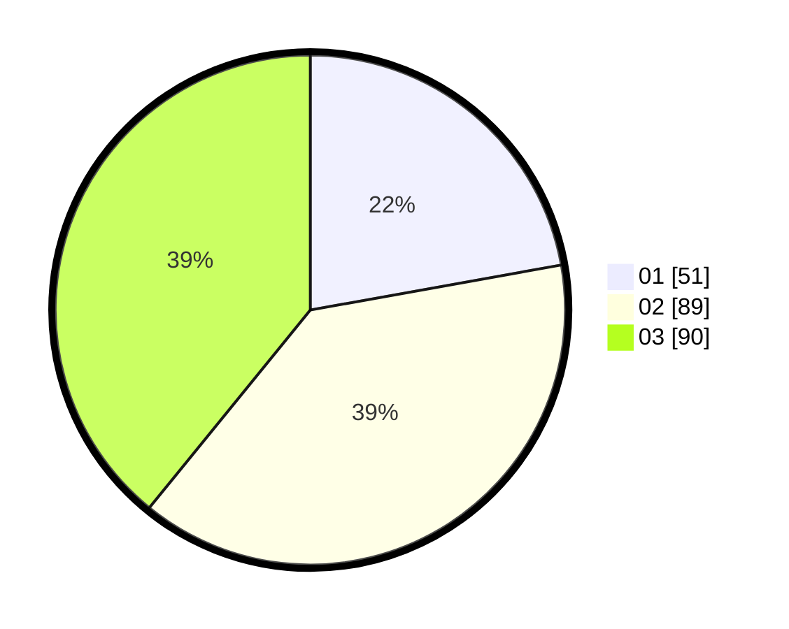

# Hasil

Hasil perolehan suara paslon dapat dilihat pada file paslon-01.txt, paslon-02.txt, dan paslon-03.txt.

Jika tidak ada, artinya data tersebut belum ada pada SIREKAP.

## Perolehan Suara

 * Paslon 01: **51**.
 * Paslon 02: **89**.
 * Paslon 03: **90**.

## Foto C Plano

https://sirekap-obj-formc.kpu.go.id/304a/pemilu/ppwp/31/74/06/10/02/3174061002090-20240214-230239--32df9911-06c7-4b60-b8ca-e1c549453b3d.jpg

https://sirekap-obj-formc.kpu.go.id/304a/pemilu/ppwp/31/74/06/10/02/3174061002090-20240214-230319--b5249d04-422d-4ca5-8308-14d655b33504.jpg

https://sirekap-obj-formc.kpu.go.id/304a/pemilu/ppwp/31/74/06/10/02/3174061002090-20240214-230425--338ac4e6-32b8-4eff-85f8-bda0868101e9.jpg

## DATA PEMILIH TETAP

Jumlah pemilih dalam DPT: **287**.
 * L: **131**.
 * P: **156**.

## DATA PENGGUNA HAK PILIH

Jumlah pengguna hak pilih dalam DPT: **223**.
 * L: **106**.
 * P: **117**.

Jumlah pengguna hak pilih dalam DPTb: **10**.
 * L: **1**.
 * P: **9**.

Jumlah pengguna hak pilih dalam DPK: **3**.
 * L: **1**.
 * P: **2**.

Jumlah pengguna hak pilih: **236**.
 * L: **108**.
 * P: **128**.

## JUMLAH SUARA SAH DAN TIDAK SAH

JUMLAH SELURUH SUARA SAH: **230**.

JUMLAH SUARA TIDAK SAH: **6**.

JUMLAH SELURUH SUARA SAH DAN SUARA TIDAK SAH: **236**.
