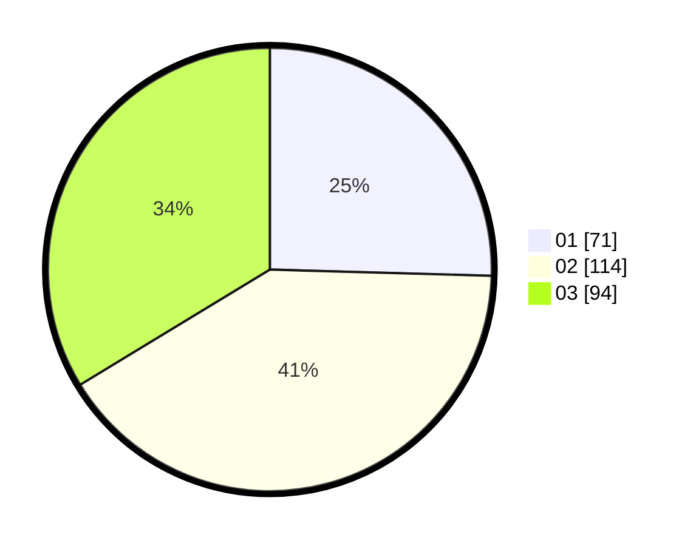

# Hasil

Hasil perolehan suara paslon dapat dilihat pada file paslon-01.txt, paslon-02.txt, dan paslon-03.txt.

Jika tidak ada, artinya data tersebut belum ada pada SIREKAP.

## Perolehan Suara

 * Paslon 01: **71**.
 * Paslon 02: **114**.
 * Paslon 03: **94**.

## Foto C Plano

https://sirekap-obj-formc.kpu.go.id/d063/pemilu/ppwp/31/74/06/10/02/3174061002091-20240218-164838--5f8fe255-facd-4977-8d0c-1a0b6e1f1e9e.jpg

https://sirekap-obj-formc.kpu.go.id/d063/pemilu/ppwp/31/74/06/10/02/3174061002091-20240218-164958--56be8896-0b1a-444d-a78b-fa7358c0d589.jpg

https://sirekap-obj-formc.kpu.go.id/d063/pemilu/ppwp/31/74/06/10/02/3174061002091-20240218-165119--c1d1fc5a-a804-4b32-897f-d96066f61e6f.jpg

## DATA PEMILIH TETAP

Jumlah pemilih dalam DPT: **284**.
 * L: **130**.
 * P: **154**.

## DATA PENGGUNA HAK PILIH

Jumlah pengguna hak pilih dalam DPT: **251**.
 * L: **113**.
 * P: **138**.

Jumlah pengguna hak pilih dalam DPTb: **51**.
 * L: **5**.
 * P: **11**.

Jumlah pengguna hak pilih dalam DPK: **17**.
 * L: **8**.
 * P: **409**.

Jumlah pengguna hak pilih: **284**.
 * L: **126**.
 * P: **158**.

## JUMLAH SUARA SAH DAN TIDAK SAH

JUMLAH SELURUH SUARA SAH: **279**.

JUMLAH SUARA TIDAK SAH: **5**.

JUMLAH SELURUH SUARA SAH DAN SUARA TIDAK SAH: **284**.
