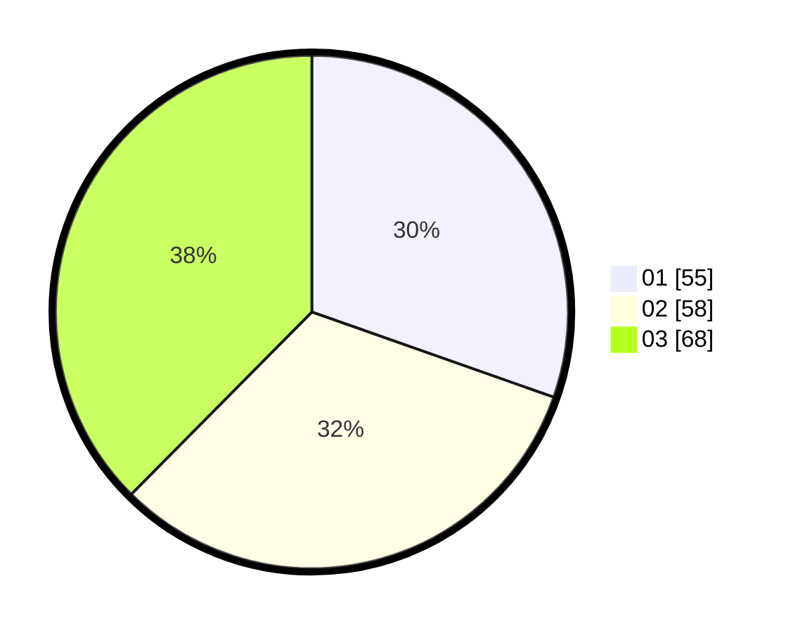

# Hasil

Hasil perolehan suara paslon dapat dilihat pada file paslon-01.txt, paslon-02.txt, dan paslon-03.txt.

Jika tidak ada, artinya data tersebut belum ada pada SIREKAP.

## Perolehan Suara

 * Paslon 01: **55**.
 * Paslon 02: **58**.
 * Paslon 03: **68**.

## Foto C Plano

https://sirekap-obj-formc.kpu.go.id/615a/pemilu/ppwp/31/74/06/10/02/3174061002093-20240218-165407--29d92ef7-9314-464e-ba06-d545a1c525b6.jpg

https://sirekap-obj-formc.kpu.go.id/615a/pemilu/ppwp/31/74/06/10/02/3174061002093-20240218-165544--f1f44643-728c-4655-af72-7058a47230cf.jpg
