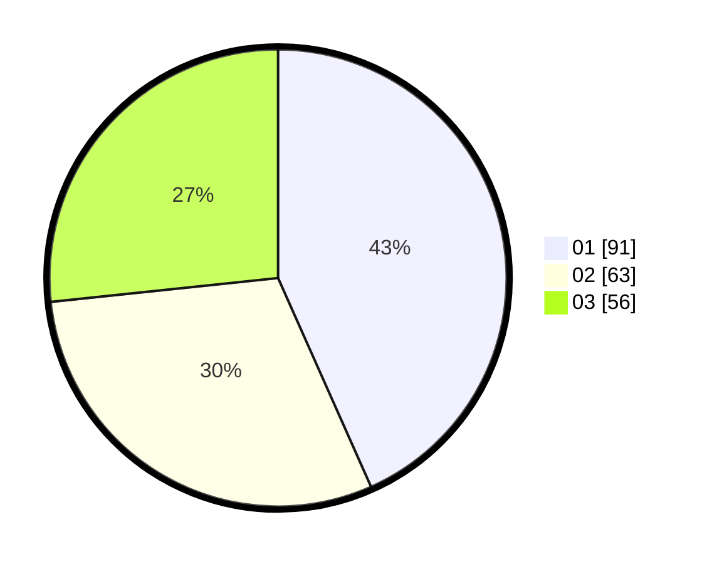

# Hasil

Hasil perolehan suara paslon dapat dilihat pada file paslon-01.txt, paslon-02.txt, dan paslon-03.txt.

Jika tidak ada, artinya data tersebut belum ada pada SIREKAP.

## Perolehan Suara

 * Paslon 01: **91**.
 * Paslon 02: **63**.
 * Paslon 03: **56**.

## Foto C Plano

https://sirekap-obj-formc.kpu.go.id/d835/pemilu/ppwp/31/74/06/10/02/3174061002097-20240214-213719--364289a1-37c5-4346-a771-5692ed77b324.jpg

https://sirekap-obj-formc.kpu.go.id/d835/pemilu/ppwp/31/74/06/10/02/3174061002097-20240214-211905--91e853b6-6822-4a6a-a287-9ea196164d24.jpg

https://sirekap-obj-formc.kpu.go.id/d835/pemilu/ppwp/31/74/06/10/02/3174061002097-20240214-211954--a0063f0f-56ef-41a3-ac0b-9b58e6362de0.jpg
