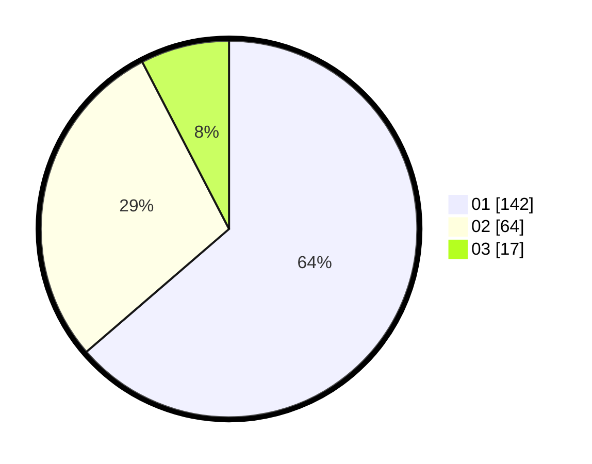

# Hasil

Hasil perolehan suara paslon dapat dilihat pada file paslon-01.txt, paslon-02.txt, dan paslon-03.txt.

Jika tidak ada, artinya data tersebut belum ada pada SIREKAP.

## Perolehan Suara

 * Paslon 01: **142**.
 * Paslon 02: **64**.
 * Paslon 03: **17**.

## Foto C Plano

https://sirekap-obj-formc.kpu.go.id/431c/pemilu/ppwp/31/74/06/10/02/3174061002100-20240217-110325--6558cd4c-969b-41f9-9fb7-90a443a11582.jpg

https://sirekap-obj-formc.kpu.go.id/431c/pemilu/ppwp/31/74/06/10/02/3174061002100-20240217-110458--ee3ce775-121d-41c7-8e17-15649397878f.jpg

https://sirekap-obj-formc.kpu.go.id/431c/pemilu/ppwp/31/74/06/10/02/3174061002100-20240217-110541--5aea82e3-04f7-4a52-a850-0051c34445a0.jpg

## DATA PEMILIH TETAP

Jumlah pemilih dalam DPT: **278**.
 * L: **129**.
 * P: **149**.

## DATA PENGGUNA HAK PILIH

Jumlah pengguna hak pilih dalam DPT: **218**.
 * L: **99**.
 * P: **119**.

Jumlah pengguna hak pilih dalam DPTb: **2**.
 * L: **1**.
 * P: **1**.

Jumlah pengguna hak pilih dalam DPK: **3**.
 * L: **1**.
 * P: **2**.

Jumlah pengguna hak pilih: **223**.
 * L: **0**.
 * P: **0**.

## JUMLAH SUARA SAH DAN TIDAK SAH

JUMLAH SELURUH SUARA SAH: **223**.

JUMLAH SUARA TIDAK SAH: **4**.

JUMLAH SELURUH SUARA SAH DAN SUARA TIDAK SAH: **227**.
